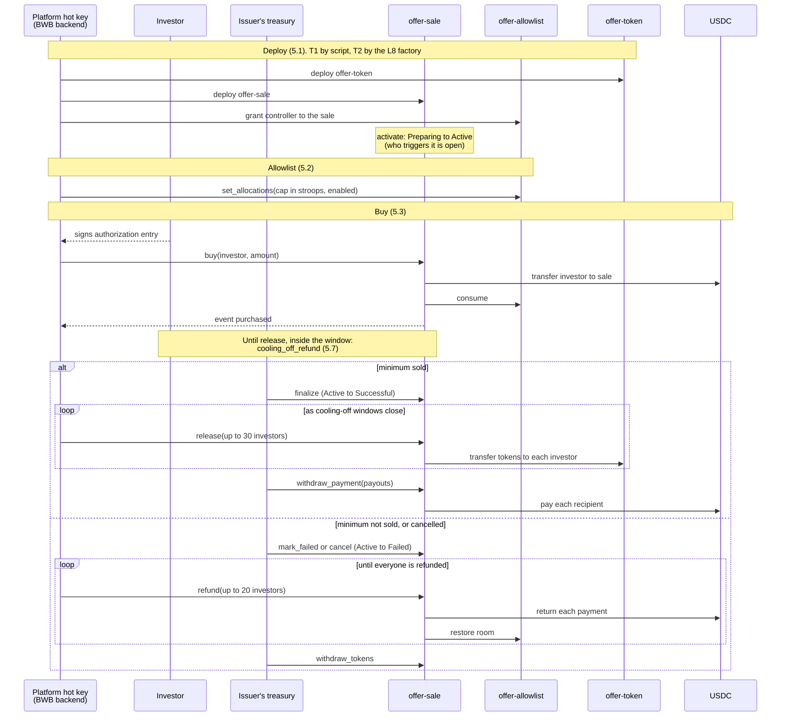
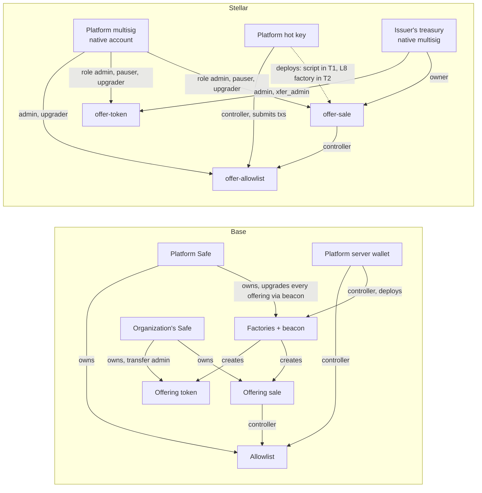

# Backend ↔ contracts interface

| | |
|---|---|
| Version | 0.4 (draft) |
| Status | Under review ([#23](https://github.com/BWB-Labs/bwb-stellar/issues/23)) |
| Contracts | `offer-token`, `offer-allowlist`, `offer-sale` (Tranche 1) |
| Stack | soroban-sdk 26.1, OpenZeppelin Stellar Contracts 0.7.2, protocol 29 |

This document defines how the BWB backend works with the Soroban contracts that carry BWB's offerings on Stellar. Each contract has its own document with its calls, events and errors:

- [offer-token.md](offer-token.md): the investor's quota token, one per offering.
- [offer-allowlist.md](offer-allowlist.md): who may invest and up to how much, one for the whole platform.
- [offer-sale.md](offer-sale.md): escrow and lifecycle of one offering.

## Contents

- [In one page](#in-one-page)
- [Life of an offering](#life-of-an-offering)
- Decisions
  1. [Parties, roles and keys](#1-parties-roles-and-keys)
  2. [From Base to Stellar](#2-from-base-to-stellar)
  3. [Premises](#3-premises)
  4. [Invocation and authorization](#4-invocation-and-authorization)
  5. [Flows](#5-flows)
  6. [Events](#6-events)
  7. [Errors](#7-errors)
  8. [Grant vocabulary and AUM inputs](#8-grant-vocabulary-and-aum-inputs)
  9. [Storage and expiry](#9-storage-and-expiry)
  10. [What the backend registry needs](#10-what-the-backend-registry-needs)
  11. [Open points](#11-open-points)
  12. [Risks](#12-risks)
- [Reference](#reference)
  - [R1. Stellar terms](#r1-stellar-terms)
  - [R2. Signing details](#r2-signing-details)
  - [R3. Multisig signature format](#r3-multisig-signature-format)
  - [R4. Inherited event shapes](#r4-inherited-event-shapes)
  - [R5. Event sizes](#r5-event-sizes)
  - [R6. Error codes](#r6-error-codes)
  - [R7. Network limits](#r7-network-limits)
  - [R8. Registry IDs](#r8-registry-ids)
- [Changelog](#changelog)

## In one page

**What this is.** The agreement between two layers: the BWB backend and the Soroban contracts. It says how the backend calls the contracts, who signs each call, what the contracts report back, and the rules both sides rely on. The contracts port BWB's Base (EVM) contracts. Where the Base backend already does something and Stellar can do it the same way, this document keeps Base's shape. Where Stellar can't, it says what replaces it. The contracts don't exist yet: they are written after this document, in L2–L4.

**Who it is for.** The BWB backend team, the reviewer who accepts it, and AI agents that use it as context. The decision sections (1–12) read top to bottom. Byte formats, measured sizes, error-code ranges, network limits and IDs sit in the [Reference](#reference) part at the end.

**What a backend developer must know.**

- **Who signs.** BWB builds, simulates and submits every transaction and pays its fee. The investor, or the officers of an organization's treasury, sign only an *authorization entry*: a 32-byte hash that approves one call with fixed arguments. This is pattern (B), the recommended one ([4.1](#41-two-patterns)). The issuer's treasury signs closing, payout, unpause, admin transfers and token withdrawal. The platform hot key writes the allowlist. The platform multisig holds the roles and the upgrades, and can pause ([1](#1-parties-roles-and-keys)).
- **How deployment works.** In Tranche 1 (T1), the repository's deploy script deploys each offering, and the backend only registers the addresses it records. From Tranche 2 (T2), the backend deploys with one call to the L8 factory ([5.1](#51-deploying-an-offering)).
- **How a purchase is confirmed.** By the `purchased` event, never by the transaction status alone. A rejected purchase fails with an error code and emits nothing ([5.3](#53-investing)).
- **What to read, and where.** Read current state by *simulating* the contracts' read functions: a dry run through RPC that changes nothing. Read history from events. RPC keeps events for only about 7 days, so the backend ingests them continuously from a stored cursor ([6.3](#63-ingestion)).
- **Units.** Payments are in USDC *stroops*, the 7-decimal base unit (1 USDC = 10,000,000 stroops). Investor limits are in BRL, and the backend converts them to stroops. One token is one quota ([3](#3-premises)).
- **Cooling-off differs from Base.** Tokens are never released to an investor whose cooling-off window is still open. The issuer can only withdraw payment for reservations already released. So the order is: release everyone past their window, then withdraw ([3](#3-premises), [5.5](#55-after-success)).
- **Batches.** At most 30 investors per release call, 20 per refund call, 30 entries per allowlist batch, and 30 payouts per `withdraw_payment` ([3](#3-premises)).
- **Open points** are listed in [11](#11-open-points). Each one changes this document through the changelog.

**Stability.** Until L4 lands, the document stays at 0.x and may change. Every change goes in the [changelog](#changelog) and is announced to the team. From 1.0, events change only by the [additive rule](#61-rules).

**Out of scope.** Stellar protocol work that involves no contract here (account creation, reserve sponsorship, USDC trustlines, fee-payer account pools, network error handling), any TypeScript code, the AUM query, the evidence index, and key custody.

## Life of an offering

This walkthrough follows one offering from deployment to payout or refund. Each step links to its flow in [section 5](#5-flows).

1. **Deploy.** In T1 the deploy script, signing with the platform hot key, deploys `offer-token` and `offer-sale` at precomputed addresses and makes the sale a `controller` on the allowlist. The sale starts in Preparing. It moves to Active when activated, after checking it holds the whole supply. The backend registers the addresses ([5.1](#51-deploying-an-offering)).
2. **Allowlist.** After KYC, the platform hot key writes the investor's cap, in stroops, to the global allowlist. Every month it resets what investors have used ([5.2](#52-allowlist)).
3. **Buy.** The investor signs an authorization for `buy(investor, amount)` and BWB submits it. The sale pulls the USDC into escrow, reserves tokens for the investor and consumes allowlist room. Each purchase restarts that investor's cooling-off window ([5.3](#53-investing)).
4. **Cooling-off.** Inside their window, the investor may call `cooling_off_refund` to get the payment back. This works while the offering is Active or Successful, until their tokens are released ([5.7](#57-cooling-off)).
5. **Close.** The issuer's treasury calls `finalize` (Successful), or `mark_failed` or `cancel` (Failed) ([5.4](#54-closing-an-offering)).
6. **After success.** The backend releases tokens in batches as windows close. Then the issuer's treasury pays every recipient in one `withdraw_payment` call ([5.5](#55-after-success)).
7. **After failure.** The backend refunds investors in batches, and the issuer's treasury may take the tokens back ([5.6](#56-after-failure)).
8. **Pause.** At any point, the issuer's treasury or the platform multisig may pause the token or the sale. Only the treasury unpauses ([5.8](#58-pause-admin-transfer-and-upgrade)).



Release and refund are open to anyone; the diagram shows the backend calling them because the backend runs those jobs.

## 1. Parties, roles and keys

Vocabulary follows the glossary of BWB's Base application.

- **Investor:** a user buying through their **wallet** (one signer), or an organization buying through its **treasury** (a threshold of officers). The contracts treat both the same: an address that authorized the call.
- **Issuer:** the organization raising money through an offering. Its treasury administers the offering.
- **Offering:** one `offer-token` contract plus one `offer-sale` contract.
- **Platform multisig:** BWB's own threshold account. It is used rarely.
- **Platform hot key:** a single BWB key held by the backend, which signs without a human.

| Role | Contract | Held by | Can |
|---|---|---|---|
| admin (stored address) | `offer-token` | issuer's treasury | manage the transfer whitelist and the offering URI, pause and unpause |
| `xfer_admin` (stored address, fixed at construction) | `offer-token` | issuer's treasury | move tokens between any two accounts, even while paused |
| owner (stored address) | `offer-sale` | issuer's treasury | finalize, mark failed, cancel, withdraw payment, withdraw tokens after failure, pause and unpause |
| access-control admin | all three | platform multisig | grant and revoke the roles below |
| `pauser` | `offer-token`, `offer-sale` | platform multisig | pause only, never unpause |
| `upgrader` | all three | platform multisig | replace the contract's code |
| `controller` | `offer-allowlist` | platform hot key, and each offering's `offer-sale` | write allocations, consume and restore them, reset consumption, grant and revoke `controller` |

**Why the issuer's roles are stored addresses.** OpenZeppelin always lets its top access-control admin grant and revoke any role. An issuer holding it could grant itself `upgrader` or remove the platform's `pauser`. So the issuer holds plain stored addresses, and the platform holds OpenZeppelin's access-control admin.

Two choices here deliberately differ from what a reader might expect:

- **The platform holds upgrades, not the offering's admin.** In Base, an issuer's Safe owns its offering, but the code changes through the factory's beacon, which only the platform Safe controls. Soroban has no beacon: every contract replaces its own code. Keeping the split means a fix doesn't need a signing ceremony from every issuer.
- **The platform can pause any offering, but only the issuer unpauses.** In Base, only the offering's owner pauses, so an emergency waits on the issuer's officers.

`controller` is its own admin role, so a controller can grant and revoke it. That matches Base's `setControllerFromController` (audit NF-01, accepted), and offering deployment depends on it.

**Base and Stellar side by side.** The split of power is the same. A Safe becomes a native multisig account, and the upgrade path changes because Soroban has no beacon.



**Recommended custody.** The decision is BWB's.

- **Platform multisig:** 2 of 3, at the account's medium threshold. Soroban authorization checks the medium threshold (a native account's signer-weight threshold, see [R1](#r1-stellar-terms)).
- **Platform hot key:** a single key, limited to `controller` and to submitting transactions. It can't move funds. A leaked key lets an attacker change allocations and revoke the sale contracts' `controller` role. That freezes purchases and refunds until the platform multisig grants the role back.
- **Treasuries:** whatever threshold the organization configures.
- **Testnet (Tranche 1):** single keys for every role.

## 2. From Base to Stellar

The Base backend's layer, part by part, and what each part becomes.

| Part | Base today | Stellar | Verdict |
|---|---|---|---|
| Who signs, who submits | The investor's Privy wallet signs a UserOp hash and the platform relays it through Notus. A treasury's signers sign a Safe hash and the platform executes. | The investor or treasury signs a Soroban authorization, and BWB submits: pattern (B), recommended ([4.1](#41-two-patterns)). | Same shape |
| Deploying an offering | One atomic batch of 10 calls through factories, driven by the backend | T1: the repository's deploy script, and the backend only registers addresses. T2: one call to the L8 factory, driven by the backend ([5.1](#51-deploying-an-offering)). | Changes |
| Allowlist writes | `setAllocations` after KYC, `resetConsumed` monthly | Same calls. The cap is in USDC stroops, converted from BRL by the backend ([3](#3-premises)). | Same shape, new unit |
| Investing | `approve` + `buyWithBrla` | One `buy`. The investor's authorization covers the USDC transfer inside it. | Simpler |
| Finalize | `finalizeSale` | `finalize` | Same |
| Release and payout | One Safe batch: `releaseTokens` in chunks of 200, then one `withdrawBrla` per stakeholder | `release` in batches of at most 30 (refunds 20); `withdraw_payment` takes every payout in one call | Changes |
| Confirming an investment | Read `TokensPurchased` from the receipt | Read `purchased` from the transaction's events | Same rule, new format |
| Reading state | RPC reads; raw storage slots for the allowlist; a partial subgraph | Read functions through simulation (the allowlist gains getters), and events from RPC, which keeps them about 7 days | Changes |
| Failures | Revert strings, decoded by Notus | Numeric error codes in one block per contract ([7](#7-errors)) | Changes |
| Roles | Platform Safe, platform server wallet, the organization's Safe | Platform multisig, platform hot key, the organization's treasury (native multisig) | Same split |

Base's backend never calls cancellation, mark failed, refunds, cooling-off, pause or admin transfer. The contracts have them and the grant requires them, so [section 5](#5-flows) defines those flows for the first time.

## 3. Premises

The interface holds under these premises. Changing one is a design change, not a defect.

- **One payment asset.** Each offering's payment asset is a constructor parameter. In practice it is USDC for every offering. The allowlist cap is a single number in USDC stroops (7 decimals) shared across offerings, so a second payment asset needs a new design.
- **No exchange rates on chain.** Investor limits are in BRL (CVM 88). The backend converts the BRL limit into stroops when it writes an allocation, and recalculates at the monthly reset. Base needed no conversion because 1 BRLA = R$1. That no longer holds, and neither does "one real per quota".
- **Price.** The price per token, in USDC stroops, is fixed at deployment. A purchase must pay an exact multiple of it. The team and the issuer choose the price.
- **Token.** 0 decimals: one token is one quota. It doesn't rebase, and there is no burn or snapshot.
- **Fee on transfer.** The sale measures its USDC balance before and after each incoming transfer and credits what actually arrived, as in Base. What arrived must be an exact multiple of the price. USDC charges no fee today.
- **Batches.** At most 30 investors per release call, 20 per refund call, 30 entries per allowlist batch, and 30 payouts per `withdraw_payment`. The limit is the 16 KB of events a transaction may carry, not storage writes ([6.4](#64-batch-sizes)).
- **Cooling-off.** An investor may undo their reservation and get the payment back within the offering's window, counted from their last purchase. This holds while the offering is Active and after it succeeds, until their tokens are released. **Tokens are never released to an investor whose window is still open.** Base differs: there, anyone could release early and end the right (audit SCAN-01, recommended fix). The audit response is treated as the written request for this change.

## 4. Invocation and authorization

A Soroban transaction has a *source account*, which submits it, pays the fee and uses up one of its sequence numbers. Any other account whose approval a call needs signs an *authorization entry* instead: an approval for that one call and the sub-calls it makes, with those arguments. Terms are collected in [R1](#r1-stellar-terms).

### 4.1 Two patterns

The contracts are identical under both patterns. Each user-facing call authorizes its investor itself, and a multisig treasury authorizes exactly like a single-key wallet. **Recommended: (B).**

- **(A) The investor is the transaction source and BWB fee-bumps.** The investor signs the whole transaction. BWB wraps it in a *fee-bump* transaction, an outer transaction that pays the fee for an already signed inner one.
- **(B) BWB is the transaction source and the investor signs only an authorization entry.** BWB builds, simulates and submits the transaction. The investor signs a 32-byte hash of "this call, with these arguments".

| | (A) investor source + fee-bump | (B) BWB source + authorization entry |
|---|---|---|
| What the investor signs | The inner transaction: resources, resource fee, sequence number | Only the authorization: network, nonce, expiry ledger, invocation tree |
| Retry or re-simulation after signing | Needs a new signature. A fee-bump can't change the inner resource fee. | BWB rebuilds freely. The signature stays valid until it expires or the transaction succeeds. |
| Sequence number | The investor's, consumed even on failure | BWB's |
| Investor account must exist | Yes | Yes. The host loads the account to check signatures. |
| Investor needs XLM | No | No |
| Treasury multisig | Signatures are bound to the treasury's sequence number and go stale if it moves | Officers sign the same hash independently, at any time before expiry |
| Transaction hashes | Two: outer and inner. An inner failure shows as `txFEE_BUMP_INNER_FAILED`, with the inner hash in the result. | One |
| Cost | The fee-bump counts as one more operation | Lower |
| What the wallet must sign | A 32-byte transaction hash, ed25519 | A 32-byte hash, ed25519 |

Privy supports Stellar at its Tier 2: it signs a raw 32-byte hash with ed25519, server side and client side. Either pattern fits. Privy does not broadcast or sponsor on Stellar.

**Why (B):**

- **It mirrors Base.** There, the investor signs a UserOp hash and the platform relays; treasury officers sign offline and the platform executes.
- **The signature covers no fee or sequence number.** BWB can retry, re-simulate and adjust fees without asking the investor again.
- **Treasury officers can sign the same hash independently** until it expires, and no signature goes stale.
- **It is cheaper**, with one transaction hash instead of two.

Pattern (A) stays documented for the case where a wallet can only sign whole transactions.

### 4.2 The purchase authorization tree

`buy(investor, amount)` authorizes `investor` first, then moves USDC from the investor to the sale. The investor's authorization entry therefore covers this tree:

```
offer-sale.buy(investor, amount)
└── usdc.transfer(investor, offer-sale, amount)
```

Simulation records this tree. Before asking for a signature, the backend checks that the tree's root is the offering's sale contract. A tree rooted at `usdc.transfer` alone would authorize a bare payment tied to no offering.

The sale's call into the allowlist (`consume`) needs no authorization entry. The allowlist authorizes the sale contract as the direct caller.

### 4.3 Signing rules

- **What the signature covers.** The network, a nonce, an expiry ledger and the call tree. It covers no sequence number, fee or resources. Changing any argument of the call invalidates the signature.
- **Expiry.** Each authorization expires at a ledger number. Ledgers close about every 5 seconds, so Base's 30-minute approval window is about 360 ledgers.
- **Resubmission.** The nonce is consumed only when the transaction succeeds, so a signed authorization can be resubmitted until it succeeds or expires.
- **Multisig treasury.** The signers' weights must reach the treasury's medium threshold. Signers and weights are checked when the transaction runs, not when the signature is made. The signature format is in [R3](#r3-multisig-signature-format).
- **Simulate twice.** The first simulation records the authorizations without checking signatures, so it under-counts CPU. After attaching the signatures, re-simulate in enforcing mode.
- **Calls by BWB keys** (the hot key or the platform multisig) use the same mechanism. Under (B), a hot-key call can use source-account credentials, because the hot key is the transaction source.

Payload bytes, nonce storage, the maximum expiry and signature costs are in [R2](#r2-signing-details).

## 5. Flows

Each step names its signer. The per-contract documents list each call's preconditions and errors.

### 5.1 Deploying an offering

**Who deploys.**

- **In Tranche 1, the repository's deploy script deploys offerings, not the backend.** The backend doesn't automate deployment in T1. It registers the addresses the script records in [`deployments/testnet.json`](../deployments/testnet.json).
- **From Tranche 2, the factories (L8) deploy and wire an offering in one call.** The backend's automated deployment flow is built then, on top of the factory, and replaces the script.
- This saves the team from building a multi-transaction flow that the factory would retire three months later.

**Why T1 needs several transactions.** Soroban runs one contract call per transaction. Batching, which Base does through the Kernel smart account, needs a contract to do it, and that contract is the L8 factory. Without it, the script runs a sequence of transactions.

**Addresses are known in advance.** A contract's address is `sha256(networkID, deployer, salt)`. It doesn't depend on the code or the constructor arguments, so every address is computed before anything is deployed. This replaces Base's prediction from the factory nonce, which breaks when two deployments race.

The script's sequence:

1. **Compute addresses.** One salt for the token and one for the sale. Both addresses derive from the deployer, the platform hot key.
2. **Deploy `offer-token`.** Signed by the platform hot key. The constructor sets:
   - `admin` and `xfer_admin`: the issuer's treasury;
   - `pauser` and `upgrader`: the platform multisig;
   - name, symbol, supply and offering URI;
   - the initial transfer whitelist, which includes the precomputed sale address.
3. **Deploy `offer-sale`.** Signed by the platform hot key. The constructor sets:
   - owner: the issuer's treasury;
   - `pauser` and `upgrader`: the platform multisig;
   - the token, the payment asset, the price, the allowlist;
   - the configuration: hard cap, cooling-off seconds, minimum success percent.
4. **Grant `controller` to the sale** on the allowlist. Signed by the platform hot key, as a controller.
5. **Activate the sale.** The sale checks that it holds the whole supply, then moves from Preparing to Active.

Ownership is final from the constructors, so nothing transfers ownership afterwards.

**Requirements on inventory** (open, decided in L2/L4):

- no key ever holds the offering's tokens;
- deployment adds no signature for the issuer.

In Base the issuer signs nothing on chain at deployment; the platform wallet does every step. The leading candidate is for the token's constructor to mint the whole supply straight to the sale's precomputed address. Who triggers activation follows from that choice. The same requirements apply to the L8 factory.

**Retrying a step.** The script is re-runnable. Deploying to an address that is already taken fails, so a retried step first checks whether its contract exists. If step 3 fails after step 2 succeeded, the tokens wait at the sale's address until step 3 is retried with the same salt.

### 5.2 Allowlist

1. **KYC approved.** The platform hot key calls `set_allocations` with the investor's address, the cap in stroops (converted from the BRL limit) and `enabled = true`. Repeating the same call is safe.
2. **Before each purchase**, the backend may read `allocation` or `remaining` instead of reading storage.
3. **Monthly**, the platform hot key calls `reset_consumed` for investors with confirmed purchases, in batches of at most 30, and recalculates caps if the exchange rate moved.

### 5.3 Investing

1. The backend simulates `buy(investor, amount)`. `amount` is in stroops and must be an exact multiple of the price.
2. The investor (wallet) or the officers (treasury) sign the authorization ([4](#4-invocation-and-authorization)).
3. The backend submits the transaction under the chosen pattern.
4. The **`purchased` event confirms the purchase**, never the transaction status alone, as in Base. A purchase rejected for eligibility, allocation, supply or hard cap fails the transaction with an error code and emits nothing ([7.3](#73-rejections-as-evidence)).

### 5.4 Closing an offering

The issuer's treasury signs one of these while the offering is Active:

| Call | When | Result |
|---|---|---|
| `finalize` | The minimum success percent is sold, or everything is sold | Successful |
| `mark_failed` | The minimum is not sold | Failed |
| `cancel` | Any time | Failed |

### 5.5 After success

- **Release.** Anyone may call `release(investors)`, in batches of at most 30. It delivers each investor's reserved tokens and ends the reservation.
  - An investor with nothing reserved is skipped silently.
  - An investor whose cooling-off window is still open fails the whole call. The backend leaves those investors out of the batch, since it knows each last purchase from the `purchased` events.
  - A failed token transfer also fails the whole call, as in Base.
- **Payout.** The issuer's treasury signs one `withdraw_payment(payouts)` call with every recipient and amount: issuer, distributor, platform, tokenizer. In Base this was one Safe batch with one withdrawal per stakeholder. One call keeps it to one signing ceremony.
- **Only released money can be withdrawn.** `withdraw_payment` takes at most the payment of reservations already released, minus what was withdrawn before. Money an investor can still ask back never leaves the sale. The order is: release everyone past their window, then withdraw.
  - Base differs: there, the issuer could withdraw everything at once (audit NF-04, accepted).
  - Base's backend got away with it by releasing every investor in the same batch as the withdrawal. That silently ended any cooling-off right still open.
- **Leftover tokens** stay locked in the sale, as in Base. That covers tokens returned through cooling-off (audit SCAN-02) and tokens never sold, because withdrawing tokens requires Failed. This may change in L4.

### 5.6 After failure

- **Refunds.** Anyone may call `refund(investors)`, in batches of at most 20. Each investor gets their payment back, the reservation ends, and the allowlist room is restored.
  - **Known issue carried from Base:** restoring room fails when the monthly reset already set the investor's usage to 0. A refund after a reset therefore fails, together with its whole batch. The same happens to cooling-off. See [offer-allowlist](offer-allowlist.md#known-issue-refunds-after-the-monthly-reset); it is decided in L3.
  - An investor with nothing reserved is skipped silently.
  - A failed USDC transfer fails the whole call, as in Base. A typical cause is an investor account that lost its USDC trustline or was deauthorized by the issuer. The backend leaves that investor out and retries the rest.
- **Tokens back.** The issuer's treasury may withdraw the offering's tokens with `withdraw_tokens`.

### 5.7 Cooling-off

The investor signs `cooling_off_refund(investor)` themselves, within the window, while the offering is Active or Successful and before their tokens are released. They get their payment back, the reservation ends, and the allowlist room is restored.

### 5.8 Pause, admin transfer and upgrade

- **Pause.** The issuer's treasury or the platform multisig calls `pause(caller)` on the token or the sale. Only the treasury calls `unpause(caller)`. Each call emits `pause_changed` with the caller.
  - A paused token blocks `transfer` and `transfer_from`, so release is blocked too.
  - A paused sale blocks `buy`. Refunds and cooling-off stay available.
- **Admin transfer.** The issuer's treasury (`xfer_admin`) moves tokens between any two accounts, even while paused, for court orders, lost keys or estates.
- **Upgrade.** The platform multisig calls `upgrade` on each contract, one call per contract. The contract emits `upgraded` with the new code hash and storage schema version. Any data migration runs in a separate, versioned call.

## 6. Events

### 6.1 Rules

- **Shape.** Every event has **topics** (its name, then at most 3 more) and **data** (a map of named fields, sorted by name). Four topics is the most the RPC can filter on.
- **Emitter.** Every event carries the address of the contract that emitted it, so a sale event identifies its offering. When a sale caused an allowlist event, that event names the sale contract.
- **No optional fields.** Every field is always present. The sdk 28 upgrade drops empty optional fields from events, so consumers also treat a missing field and a null field the same.
- **Additive rule.** New fields may appear in an event at any time, and consumers ignore fields they don't know. SEP-41 sets the same rule for token events. A change that would break a consumer gets a new event name instead.
- **Amounts** are `i128`. Payment amounts are in stroops of the payment asset (USDC, 7 decimals). Token amounts are whole tokens (0 decimals). Events don't repeat decimals; the backend registry holds them per deployment.
- **Timestamps** are ledger close times in seconds.
- **Upgrade event.** Every contract emits `upgraded { new_wasm_hash, schema_version }` on upgrade. Stellar also emits a system event, `executable_update`, which has no version.

### 6.2 Events the contracts inherit

The token emits OpenZeppelin 0.7.2's standard events (`transfer`, `mint`, `approve`, `paused` / `unpaused`, `role_granted` / `role_revoked`), and so does any contract wherever it uses the library. Every payment, refund and payout also produces a `transfer` event from the USDC contract.

The two `transfer` formats differ. **A consumer of payment events handles transfers with 3 topics (OpenZeppelin) and with 4 (USDC), and data as a bare amount or as a map.** The exact shapes are in [R4](#r4-inherited-event-shapes).

### 6.3 Ingestion

The RPC keeps events for about 7 days, on both networks. The backend has to ingest continuously from a stored cursor, and can't rely on RPC history.

A filter takes at most 5 contract IDs, and a request takes at most 5 filters. With many offerings, the backend either pages over contract IDs, or filters by topic and keeps only contracts in its registry. Exact limits are in [R7](#r7-network-limits).

### 6.4 Batch sizes

The batch limits come from events, not storage. A transaction may carry at most 16 KB of events, counting the call's return value, and each investor in a batch emits several events:

| Call | Events per investor | Limit per call |
|---|---|---|
| `release` | token `transfer` + `released` | 30 |
| `refund` | USDC `transfer` + `refunded` + allowlist `allocation_restored` | 20 |
| `set_allocations`, `reset_consumed` | one allowlist event | 30 |

The per-investor sizes are estimates, to be confirmed by simulation in L4. At the limits they fill about 11.1 KB (release), 14.6 KB (refund) and 6 KB (allowlist). Measured sizes and the arithmetic are in [R5](#r5-event-sizes).

Each investor keeps their own event because the backend's ledger records one movement per investor.

## 7. Errors

### 7.1 Codes

A failure returns `Error(Contract, #n)`. Each contract has its own block of codes, clear of every OpenZeppelin range ([R6](#r6-error-codes)). The codes themselves are in each contract's document.

An error raised by a contract the call passes through comes back unchanged. So a failed `buy` can carry an allowlist code, a token code, an OpenZeppelin code or a USDC code. The OpenZeppelin codes the backend will meet are in [R6](#r6-error-codes).

A missing or invalid signature is not a contract code. It fails as `Error(Auth, …)` before the contract decides anything.

### 7.2 Reading a failure

- **Before submitting:** simulation returns the error code. This is where most rejections should be caught.
- **After submitting:** a failed transaction's result only says `INVOKE_HOST_FUNCTION_TRAPPED`. The code is in the transaction's **diagnostic events**, which RPC returns as `diagnosticEventsXdr` when the node keeps them. Explorers show them. Diagnostic events also say which contract raised the error.

### 7.3 Rejections as evidence

Eligibility and allocation rejections emit no event: the transaction fails, lands on the ledger and pays its fee. The evidence for the grant (D2, criterion 2) is the failed transaction's hash plus the documented code:

- `6100 InvestorNotEnabled` for eligibility;
- `6101 AllocationExceeded` for allocation.

This proof is practical, not consensus-level. Diagnostic events are not part of the ledger's hash, and only nodes that keep them return them.

The demonstration script at the end of L4 builds these failing transactions with a hand-made *footprint* (the list of ledger entries a transaction declares it will read and write). It must, because simulating a failing call returns no footprint.

## 8. Grant vocabulary and AUM inputs

### 8.1 The grant's terms

| D2 term | Events |
|---|---|
| Issuance | `offer-token` `mint` at construction; `offer-sale` `activated` |
| Allocation | `offer-allowlist` `allocation_set`, `allocation_consumed`, `allocation_restored`, `consumed_reset` |
| Investment | `offer-sale` `purchased` |
| Pause / unpause | `paused` / `unpaused` on `offer-token` and `offer-sale` |
| Cooling-off | `offer-sale` `refunded` with reason `cooling_off` |
| Cancellation | `offer-sale` `cancelled` or `marked_failed`, each with `state_changed` Active → Failed |
| Refund | `offer-sale` `refunded` with reason `failed` |
| Settlement | `offer-sale` `released` (tokens to the investor) and `payment_withdrawn` (payment to the recipients) |
| Eligibility rejection | failed transaction, code 6100 |
| Allocation rejection | failed transaction, code 6101; also 6207 (over supply) and 6208 (over hard cap) |

### 8.2 What moves value

The AUM query and its definition belong to the team, including questions such as whether money still in escrow counts. These events move value:

| Event | Effect |
|---|---|
| `mint` (token) | Supply created. Held by the sale until released. |
| `purchased` | + payment into escrow, + tokens reserved for the investor |
| `refunded` | − payment from escrow, − tokens reserved |
| `released` | Tokens move from reservation to the investor's balance. Escrow is unchanged. |
| `payment_withdrawn` | − payment from escrow, to the recipient |
| `transfer` (token), after release | Holdings change hands: whitelisted transfers, or admin transfers |
| `tokens_withdrawn` | Tokens leave a failed offering, back to the issuer |

No event carries personal data: only addresses and amounts.

## 9. Storage and expiry

On Stellar, every piece of contract data has a lifetime, its *TTL* (time to live, counted in ledgers). Data whose TTL runs out is *archived*. Archived data is restored automatically on its next use, at extra cost to that transaction.

| Data | Storage | Where |
|---|---|---|
| Allocation per investor | persistent, one entry per investor | `offer-allowlist` |
| Reservation per investor | persistent, one entry per investor | `offer-sale` |
| Balance per holder | persistent (OpenZeppelin) | `offer-token` |
| Roles | persistent (OpenZeppelin) | all |
| State, configuration, totals, admin, pause flag | instance | all |

*Persistent* storage keeps one entry per key, each with its own TTL. *Instance* storage is a single entry that lives with the contract.

- **The contracts extend** their instance and every entry they touch, on every call. OpenZeppelin extends balances and roles but never the instance, so the contracts do it.
- **There is no backend keep-alive job.** Anyone may extend any entry without permission (`ExtendFootprintTTLOp`), so the team can add one later without contract changes.
- **Testnet data archives quickly.** New entries live far shorter on testnet than on mainnet ([R7](#r7-network-limits)), so idle testnet data archives within days.
- **Persistent structs carry a schema version.** The full TTL policy is L9.

## 10. What the backend registry needs

The Base application's registry knows Stellar mainnet only. For Tranche 1 on testnet it needs:

- **The testnet chain**, identified by its network ID.
- **The USDC testnet deployment:** its contract ID, its asset code and issuer, and its 7 decimals.
- **The allowlist** and each offering's token and sale contract, from [`deployments/testnet.json`](../deployments/testnet.json).

The values are in [R8](#r8-registry-ids). Testnet resets periodically, so these contract IDs change with every redeploy.

## 11. Open points

Decided later. Each one changes this document through the changelog.

| Point | Today | Decided in |
|---|---|---|
| Inventory at deployment, and who activates | Mint straight into the sale is the leading candidate | L2 / L4 |
| Batch sizes (30 release, 20 refund) | Estimates with margin. L4 measures real event sizes and raises the limits as far as they fit, for example by trimming per-investor events. The backend needs a job that releases investors in rolling batches as their windows close. | L4, and the team for the job |
| Batch behaviour when one investor can't be served | Revert the whole call, as in Base; the alternative is skip and report | L4 |
| Leftover tokens after success | Locked, as in Base | L4 |
| Restoring allowlist room after the monthly reset | Fails, as in Base. Candidate fixes: restore at most what is consumed; or a **lazy reset**, where each allocation stores the period its usage belongs to and a purchase in a new period starts from zero. The lazy reset needs no monthly reset run and lets a refund give room back only within the same period. Open question for the team: calendar month or fixed 30-day period? | L3 |
| What a paused sale blocks | `buy` only | L4 |
| Definition of AUM | Inputs listed in [8.2](#82-what-moves-value) | The team |
| Custody of each key | Recommendation in [1](#1-parties-roles-and-keys) | BWB |

## 12. Risks

- **soroban-sdk 26.x is outside the SDK's security window.** The SDK patches only its two newest major versions, which are 27 and 28. The contracts stay on 26.1 because OpenZeppelin 0.7.2, the latest stable release, requires it. The no-optional-fields rule and the versioned persistent structs keep the move to sdk 28 cheap.
- **Both networks run protocol 29.** Limits quoted here were read live on 2026-10-02 and can change by network vote. The current values are at [lab.stellar.org/network-limits](https://lab.stellar.org/network-limits).

---

## Reference

Low-level material the decision sections point to. Read it when implementing, not to review the design.

### R1. Stellar terms

| Term | Meaning here |
|---|---|
| Stroop | The base unit of a 7-decimal Stellar amount. 1 USDC = 10,000,000 stroops. All payment amounts in this interface are USDC stroops. |
| Ledger | Stellar's block. One closes about every 5 seconds. Expiries and TTLs are counted in ledgers. |
| Source account | The account that submits a transaction, pays its fee and consumes one of its sequence numbers. |
| Authorization entry | A signed approval, attached to a transaction, for one contract call and the sub-calls it makes (its *invocation tree*), with fixed arguments. It lets an account other than the source authorize a call. |
| Simulation | Running a transaction against current ledger state through RPC without submitting it. It returns the result or error code, the authorizations the call needs, the footprint and the resource fee. It is also how the backend calls read functions. |
| Footprint | The ledger entries a transaction declares it will read and write. Simulation normally fills it in. |
| Fee-bump | An outer transaction that wraps an already signed inner transaction so that a different account pays the fee. |
| TTL, archival | Each contract data entry lives for a number of ledgers (its TTL). When that runs out the entry is archived, and its next use restores it at extra cost. |
| Persistent / instance storage | Persistent storage holds one entry per key, each with its own TTL. Instance storage is one entry tied to the contract. |
| Muxed address | An account address plus a 64-bit ID, used to tag sub-accounts under one account. Token rules apply to the underlying address; the ID shows in events as `to_muxed_id`. |
| Medium threshold | A native Stellar account's signer-weight threshold for medium operations. Soroban authorization checks it. |
| Diagnostic events | Debug events a node may record for a transaction. They are not part of the ledger hash. |
| XDR | Stellar's binary encoding for transactions, ledger entries and hashes. |
| SEP-41 | Stellar's standard token interface. |

### R2. Signing details

- **Payload.** The investor signs `sha256` of the XDR `HashIdPreimage::SorobanAuthorization { networkID, nonce, signatureExpirationLedger, invocation }`. It has no sequence number, fee or resources in it.
- **Expiry.** The authorization's `signatureExpirationLedger`. Base's 30-minute approval window is about 360 ledgers. The maximum is about 180 days.
- **Nonce.** Any `i64`, consumed only when the transaction succeeds. Each authorization writes a short-lived nonce entry, paid by the submitter.
- **Simulation cost.** Each signature costs about 0.42 M instructions, against 400 M per transaction.

### R3. Multisig signature format

For a multisig treasury, the signature is a list of `{public_key, signature}`:

- sorted strictly by public key;
- at most 20 entries;
- the signers' weights must reach the treasury's medium threshold;
- signers and weights are checked when the transaction runs, not when the signature is made.

### R4. Inherited event shapes

From OpenZeppelin 0.7.2, on `offer-token` and wherever the library is used:

| Event | Topics | Data |
|---|---|---|
| `transfer` | `transfer`, from, to | the amount as a bare `i128` |
| `transfer` to a muxed address | `transfer`, from, to | `{amount, to_muxed_id}` |
| `mint` | `mint`, to | `{amount}` |
| `approve` | `approve`, owner, spender | `{amount, live_until_ledger}` |
| `paused` / `unpaused` | `paused` / `unpaused` | `{}` |
| `role_granted` / `role_revoked` | name, role, account | `{caller}` |
| `admin_transfer_initiated` | name, current_admin | `{live_until_ledger, new_admin}` |
| `admin_transfer_completed` | name, new_admin | `{previous_admin}` |

The USDC asset contract emits differently. Its `transfer` has a fourth topic with the asset, `USDC:G…`, and its data is a bare `i128`.

### R5. Event sizes

A transaction may carry at most 16,384 bytes of events, including the call's return value. Measured sizes:

| Event | Size |
|---|---|
| OpenZeppelin `transfer` | 172 B |
| USDC `transfer` | 244 B |
| A two-field event with one address topic | about 184 B |

Per-investor estimates, to be confirmed by simulation in L4:

| Call | Events per investor | Per investor | Limit | Total at the limit |
|---|---|---|---|---|
| `release` | token `transfer` + `released` | about 370 B | 30 | about 11.1 KB |
| `refund` | USDC `transfer` + `refunded` + allowlist `allocation_restored` | about 730 B | 20 | about 14.6 KB |
| `set_allocations`, `reset_consumed` | one allowlist event | about 200 B | 30 | about 6 KB |

### R6. Error codes

Each contract's block:

| Contract | Block |
|---|---|
| `offer-token` | 6000–6099 |
| `offer-allowlist` | 6100–6199 |
| `offer-sale` | 6200–6299 |

OpenZeppelin codes the backend will meet:

| Code | Name | Meaning |
|---|---|---|
| 100 | `InsufficientBalance` | the sender doesn't hold enough |
| 101 | `InsufficientAllowance` | `transfer_from` beyond the allowance |
| 103 | `LessThanZero` | negative amount |
| 1000 | `EnforcedPause` | the contract is paused |
| 1001 | `ExpectedPause` | unpausing a contract that isn't paused |
| 2000 | `Unauthorized` | the caller lacks the role |
| 2007 | `RoleNotHeld` | revoking a role the account doesn't hold |

### R7. Network limits

Read live on 2026-10-02 under protocol 29 ([12](#12-risks)).

| Limit | Value |
|---|---|
| Ledger close time | about 5 seconds |
| Events per transaction | 16,384 bytes, including the return value |
| Instructions per transaction | 400 M |
| Authorization expiry | at most about 180 days |
| Multisig signature entries | at most 20 |
| RPC event retention | 120,960 ledgers, about 7 days, on both networks |
| RPC event filter | at most 5 contract IDs per filter, 5 filters per request, 4 topics |
| Minimum lifetime of a new entry | mainnet at least about 120 days; testnet only about 7 |

### R8. Registry IDs

- **Testnet network ID:** `cee0302d59844d32bdca915c8203dd44b33fbb7edc19051ea37abedf28ecd472`, the SHA-256 of `Test SDF Network ; September 2015`. The registry uses it as the chain's id.
- **USDC on testnet:**
  - contract `CBIELTK6YBZJU5UP2WWQEUCYKLPU6AUNZ2BQ4WWFEIE3USCIHMXQDAMA`;
  - asset `USDC:GBBD47IF6LWK7P7MDEVSCWR7DPUWV3NY3DTQEVFL4NAT4AQH3ZLLFLA5`;
  - 7 decimals.
- **Offerings and the allowlist:** [`deployments/testnet.json`](../deployments/testnet.json). These IDs change with every testnet redeploy.

## Changelog

**0.4, 2026-10-06.** Restructured for readability; no decision changed.

**0.3, 2026-10-06.** Changes from a walkthrough of every item with Leo:

- Pattern (B) is recommended; pattern (A) stays documented.
- Lazy reset per investor added as an L3 candidate for the monthly reset and the restore issue.
- Batch sizes are marked for review in L4, with the backend's rolling-release job as team work.
- In Tranche 1, offerings are deployed by the repository's script and the backend only registers addresses. From Tranche 2 the backend deploys through the L8 factory.

**0.2, 2026-10-02.** Changes after a review against Base's contracts:

- **Roles and pause:**
  - issuer roles are stored addresses, and the platform holds the access-control admin;
  - `pause` and `unpause` take a caller and emit `pause_changed`;
  - controllers can revoke as well as grant.
- **Withdrawals:** only released money can be withdrawn (NF-04).
- **Known issues:** restoring allowlist room after the monthly reset fails, as in Base; carried as a known issue.
- **Token:** the initial holder is whitelisted automatically, and snapshot is removed.
- **Sale:**
  - fee-on-transfer credits what arrives;
  - finalize checks that the sold tokens are still held;
  - the supply is read from the token;
  - `purchased` and `refunded` carry the offering's totals;
  - a new `configured` event;
  - more read functions.
- **Allowlist:** `remaining` never goes negative, and a cap of 0 is valid.
- **Events:** batch sizes re-estimated.

**0.1, 2026-10-02.** First draft.
