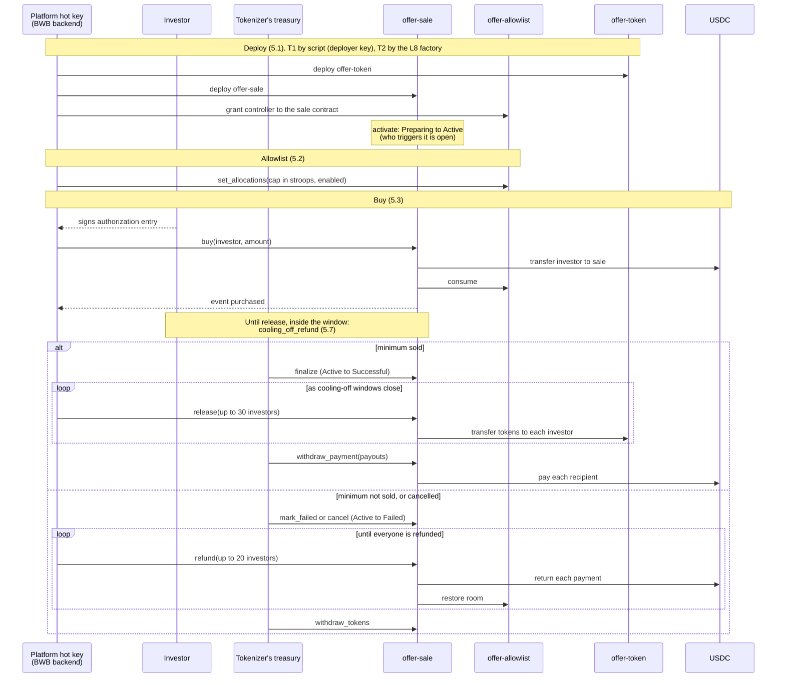
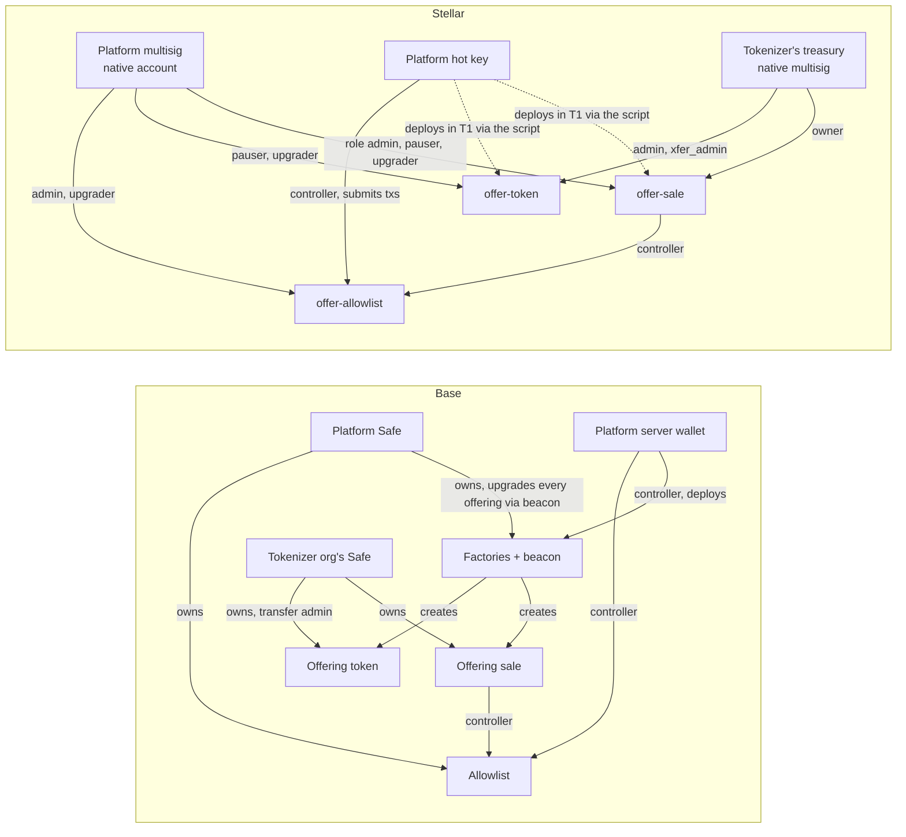

# Backend ↔ contracts interface

| | |
|---|---|
| Version | 0.6 (draft) |
| Status | Under review ([#23](https://github.com/BWB-Labs/bwb-stellar/issues/23)) |
| Contracts | `offer-token`, `offer-allowlist`, `offer-sale` (Tranche 1) |
| Stack | soroban-sdk 26.1, OpenZeppelin Stellar Contracts 0.7.2, protocol 29 |

This document defines how the BWB backend works with the Soroban contracts that carry BWB's offerings on Stellar. Each contract has its own document with its calls, events and errors:

- [offer-token.md](offer-token.md): the investor's quota token, one per offering.
- [offer-allowlist.md](offer-allowlist.md): who may invest and up to how much, one for the whole platform.
- [offer-sale.md](offer-sale.md): escrow and lifecycle of one offering.

## Contents

- [In one page](#in-one-page)
- [Life of an offering](#life-of-an-offering)
- Decisions
  1. [Parties, roles and keys](#1-parties-roles-and-keys)
  2. [From Base to Stellar](#2-from-base-to-stellar)
  3. [Premises](#3-premises)
  4. [Invocation and authorization](#4-invocation-and-authorization)
  5. [Flows](#5-flows)
  6. [Events](#6-events)
  7. [Errors](#7-errors)
  8. [Grant vocabulary and AUM inputs](#8-grant-vocabulary-and-aum-inputs)
  9. [Storage and expiry](#9-storage-and-expiry)
  10. [What the backend registry needs](#10-what-the-backend-registry-needs)
  11. [Open points](#11-open-points)
  12. [Risks](#12-risks)
- [Reference](#reference)
  - [R1. Stellar terms](#r1-stellar-terms)
  - [R2. Signing details](#r2-signing-details)
  - [R3. Multisig signature format](#r3-multisig-signature-format)
  - [R4. Inherited event shapes](#r4-inherited-event-shapes)
  - [R5. Event sizes](#r5-event-sizes)
  - [R6. Error codes](#r6-error-codes)
  - [R7. Network limits](#r7-network-limits)
  - [R8. Registry IDs](#r8-registry-ids)
- [Changelog](#changelog)

## In one page

**What this is.** The agreement between two layers: the BWB backend and the Soroban contracts. It says how the backend calls the contracts, who signs each call, what the contracts report back, and the rules both sides rely on. The contracts port BWB's Base (EVM) contracts. Where the Base backend already does something and Stellar can do it the same way, this document keeps Base's shape. Where Stellar can't, it says what replaces it. The contracts don't exist yet: they are written after this document, in L2–L4.

**Who it is for.** The BWB backend team, the reviewer who accepts it, and AI agents that use it as context. The decision sections (1–12) read top to bottom. Byte formats, measured sizes, error-code ranges, network limits and IDs sit in the [Reference](#reference) part at the end.

**What a backend developer must know.**

- **Who signs.** BWB builds, simulates and submits every transaction and pays its fee. The investor, or the officers of an organization's treasury, sign only an *authorization entry*: a 32-byte hash that approves one call with fixed arguments. This is pattern (B), the recommended one ([4.1](#41-two-patterns)). The tokenizer's treasury signs closing, payout, pause and unpause, whitelist and URI changes, admin transfers and token withdrawal. The platform hot key writes the allowlist. The platform multisig holds the roles and the upgrades, and can pause (recommended, pending the team) ([1](#1-parties-roles-and-keys)).
- **How deployment works.** In Tranche 1 (T1), the repository's deploy script deploys each offering, and the backend only registers the addresses it records. From Tranche 2 (T2), the backend deploys with one call to the L8 factory ([5.1](#51-deploying-an-offering)).
- **How a purchase is confirmed.** A successful transaction means `buy` passed; the backend reads the amounts from its `purchased` event, which is also what the ledger and the indexer keep. A rejected purchase fails the transaction with an error code and emits nothing; the failed transaction and its code are the rejection evidence. RPC keeps transactions for only about 7 days, so the backend stores the `getTransaction` response at confirmation ([5.3](#53-investing), [7.3](#73-rejections-as-evidence)).
- **What to read, and where.** Read current state by *simulating* the contracts' read functions: a dry run through RPC that changes nothing. Read history from events. RPC keeps events for only about 7 days, so the backend ingests them continuously from a stored cursor ([6.3](#63-ingestion)).
- **Units.** Payments are in USDC *stroops*, the 7-decimal base unit (1 USDC = 10,000,000 stroops). The allowlist cap is in stroops. Investor limits come from CVM 88 in BRL; whether the backend converts them or the team sets a separate dollar limit is pending the team ([3](#3-premises), [11](#11-open-points)). One token is one quota.
- **Cooling-off differs from Base (recommended, pending the team).** Tokens are never released to an investor whose cooling-off window is still open, and the tokenizer can only withdraw payment for reservations already released. So the order is: release everyone past their window, then withdraw. The consequence the team is asked to accept: the tokenizer and the issuer are paid up to `cooling_off_secs` (5 days in Base's offerings) after the last purchase ([3](#3-premises), [5.5](#55-after-success), [11](#11-open-points)).
- **Batches.** At most 30 investors per release call, 20 per refund call, 30 entries per allowlist batch, and 30 payouts per `withdraw_payment`. These are estimates, reviewed in L4 ([3](#3-premises), [6.4](#64-batch-sizes)).
- **Open points** are listed in [11](#11-open-points). Each one changes this document through the changelog.

**Stability.** Until L4 lands, the document stays at 0.x and may change. Every change goes in the [changelog](#changelog) and is announced to the team. From 1.0, events change only by the [additive rule](#61-rules).

**Out of scope.** Stellar protocol work that involves no contract here (account creation, reserve sponsorship, USDC trustlines, fee-payer account pools, network error handling), any TypeScript code, the AUM query, the evidence index, and key custody.

## Life of an offering

This walkthrough follows one offering from deployment to payout or refund. Each step links to its flow in [section 5](#5-flows).

1. **Deploy.** In T1 the deploy script, signing with the deployer key (on testnet, the platform hot key), deploys `offer-token` and `offer-sale` at precomputed addresses and makes the sale contract a `controller` on the allowlist. The sale contract starts in Preparing. It moves to Active when activated, after checking that it holds the whole supply and is a `controller` on the allowlist. The backend registers the addresses ([5.1](#51-deploying-an-offering)).
2. **Allowlist.** After KYC, the platform hot key writes the investor's cap, in stroops, to the global allowlist. Every month it resets what investors have used ([5.2](#52-allowlist)).
3. **Buy.** The investor signs an authorization for `buy(investor, amount)` and BWB submits it. The sale contract pulls the USDC into escrow, reserves tokens for the investor and consumes allowlist room. Each purchase restarts that investor's cooling-off window ([5.3](#53-investing)).
4. **Cooling-off.** Inside their window, the investor may call `cooling_off_refund` to get the payment back. This works while the offering is Active or Successful, until their tokens are released ([5.7](#57-cooling-off)).
5. **Close.** The tokenizer's treasury calls `finalize` (Successful), or `mark_failed` or `cancel` (Failed) ([5.4](#54-closing-an-offering)).
6. **After success.** The backend releases tokens in batches as windows close. Then the tokenizer's treasury pays every recipient in one `withdraw_payment` call ([5.5](#55-after-success)).
7. **After failure.** The backend refunds investors in batches, and the tokenizer's treasury may take the tokens back ([5.6](#56-after-failure)).
8. **Pause.** At any point, the tokenizer's treasury may pause the token or the sale contract; the platform multisig may too, if the team confirms it. Only the treasury unpauses ([5.8](#58-pause-admin-transfer-and-upgrade)).



Release and refund are open to anyone; the diagram shows the backend calling them because the backend runs those jobs.

## 1. Parties, roles and keys

Vocabulary follows the glossary of BWB's Base application and this repository's [`CONTEXT.md`](../CONTEXT.md).

- **Investor:** a user buying through their **wallet** (one signer), or an organization buying through its **treasury** (a threshold of officers; on Stellar, a native multisig account). The contracts treat both the same: an address that authorized the call.
- **Tokenizer:** the organization that administers an offering. Its treasury owns the offering's contracts. On Base, the owner and `transferAdmin` of every offering contract is the tokenizer organization's Safe (`tokenizerOrgId`); the issuer (the SPE, `issuerOrgId`) owns nothing on chain and only receives a payout share. This document follows that: **tokenizer** is the owner, **issuer** is a payout recipient.
- **Issuer:** the organization (SPE) that raises the money. It receives one share of the payout and holds no role on the contracts.
- **Offering:** one `offer-token` contract plus one `offer-sale` contract.
- **Platform multisig:** BWB's own threshold account. It is used rarely.
- **Platform hot key:** a single BWB key held by the backend, which signs without a human.

| Role | Contract | Held by | Can |
|---|---|---|---|
| admin (stored address) | `offer-token` | tokenizer's treasury | manage the transfer whitelist and the offering URI, pause and unpause |
| `xfer_admin` (stored address, fixed at construction) | `offer-token` | tokenizer's treasury | move tokens between any two accounts, even while paused |
| owner (stored address) | `offer-sale` | tokenizer's treasury | finalize, mark failed, cancel, withdraw payment, withdraw tokens after failure, pause and unpause |
| access-control admin | `offer-allowlist`, `offer-sale` | platform multisig | grant and revoke the roles below |
| `pauser` | `offer-token` (stored address), `offer-sale` | platform multisig | pause only, never unpause. **Recommended (ADR 0003), pending the team** |
| `upgrader` | `offer-token` (stored address), `offer-allowlist`, `offer-sale` | platform multisig | replace the contract's code |
| `controller` | `offer-allowlist` | platform hot key, and each offering's `offer-sale` | write allocations, consume and restore them, reset consumption, grant and revoke `controller` |

The stored addresses (`admin`, `xfer_admin`, owner) have no setter: they are fixed at construction, as Base's `transferAdmin` is. Rotating the treasury's officers keeps the same account address, so no setter is needed.

**Why the tokenizer's roles are stored addresses.** OpenZeppelin always lets its top access-control admin grant and revoke any role. A tokenizer holding it could grant itself `upgrader` or remove the platform's `pauser`. So the tokenizer holds plain stored addresses.

**`offer-token` has no access-control admin at all** (ADR 0005). Its four powers, `admin`, `xfer_admin`, `pauser` and `upgrader`, are all stored addresses fixed at construction. The platform holding OpenZeppelin's root would let it revoke or reassign the tokenizer's whitelist and forced-transfer powers, which Base never allowed. The contract doesn't know which party is which: the deploy passes the accounts. Changing a holder takes an upgrade. The allowlist and the sale contract settle their own model in L3 and L4.

Two choices here deliberately differ from what a reader might expect:

- **The platform holds upgrades, not the offering's admin.** In Base, the tokenizer's Safe owns its offering, but the code changes through the factory's beacon, which only the platform Safe controls. Since protocol 28 (CAP-85) Soroban has a beacon equivalent: a contract can take its code from a Wasm-hash entry owned by another contract, so one write upgrades every instance. It needs soroban-sdk ≥ 28, so the T1 contracts (sdk 26) upgrade one by one with `update_current_contract_wasm`. Keeping the split means a fix doesn't need a signing ceremony from every tokenizer. Whether the L8 factory should own the executable reference is an [open point](#11-open-points).
- **The platform can pause any offering, but only the tokenizer unpauses.** Recommended (ADR 0003), pending the team: it is a governance change. In Base, only the offering's owner pauses token transfers, and the sale contract has no pause. The platform could still stop purchases there by revoking the sale contract's allowlist `controller` role or disabling allocations. Stellar makes this explicit with `pauser`.

`controller` is its own admin role, so a controller can grant and revoke it. That matches Base's `setControllerFromController` (audit NF-01, accepted), and offering deployment depends on it.

**Base and Stellar side by side.** The split of power is the same. A Safe becomes a native multisig account. The upgrade path changes in T1 because the contracts are on sdk 26, which can't use CAP-85.



In T2 the L8 factory deploys both contracts instead of the script.

**Recommended custody.** The decision is BWB's.

- **Platform multisig:** 2 of 3, at the account's medium threshold. Soroban authorization checks the medium threshold (a native account's signer-weight threshold, see [R1](#r1-stellar-terms)).
- **Threshold setup.** A native account starts with low, medium and high thresholds of **0**, which means any single signer authorizes everything. Set the medium threshold to the quorum, the high threshold at or above it (high governs adding or removing signers and changing thresholds), and the master key's weight to 0 or count it in the weights. Circle's USDC issuer, for reference, uses low = medium = high = 2.
- **Platform hot key:** a single key, limited to `controller` and to submitting transactions. On testnet it is also the T1 deploy script's deployer key. It can't move funds. A leaked key lets an attacker change allocations and revoke the sale contracts' `controller` role. That freezes purchases and refunds until the platform multisig grants the role back.
- **Treasuries:** whatever threshold the organization configures, with the same threshold setup. Soroban checks only the medium threshold. Base's app sets its own quorum per approval type (every signer for finalize and distribution, the Safe threshold for deployment), which can be stricter than the Safe's; on Stellar any stricter quorum stays an app-level rule.
- **Testnet (Tranche 1):** single keys for every role.

## 2. From Base to Stellar

The Base backend's layer, part by part, and what each part becomes.

| Part | Base today | Stellar | Verdict |
|---|---|---|---|
| Who signs, who submits | The investor's Privy wallet signs a UserOp hash and the platform relays it through Notus; the investor pays gas in BRLA. A treasury's signers sign a Safe hash and the platform executes. | The investor or treasury signs a Soroban authorization, and BWB submits: pattern (B), recommended ([4.1](#41-two-patterns)). BWB pays every fee. | Same shape, new fee model |
| Deploying an offering | One atomic batch of 11 calls through factories (token, sale and a per-offering TokenDistributor, plus seeding, wiring and three ownership transfers), approved in-app by the tokenizer's officers and driven by the backend | T1: the repository's deploy script, and the backend only registers addresses. T2: one call to the L8 factory, driven by the backend ([5.1](#51-deploying-an-offering)). Base's TokenDistributor has no counterpart in T1. | Changes |
| Allowlist writes | `setAllocations` after KYC, `resetConsumed` monthly | Same calls. The cap is in USDC stroops. Who converts it from the BRL limit, or whether a separate dollar limit applies, is pending the team ([3](#3-premises), [11](#11-open-points)). | Same shape, new unit |
| Investing | `approve` + `buyWithBrla` | One `buy`. The investor's authorization covers the USDC transfer inside it. | Simpler |
| Finalize | `finalizeSale` | `finalize` | Same |
| Release and payout | One Safe batch: `releaseTokens` in chunks of 200, then one `withdrawBrla` per stakeholder | `release` in batches of at most 30 (refunds 20); `withdraw_payment` takes every payout in one call | Changes |
| Confirming an investment | Read `TokensPurchased` from the receipt | Read `purchased` from the transaction's events | Same rule, new format |
| Reading state | RPC reads; raw storage slots for the allowlist; a partial subgraph | Read functions through simulation (the allowlist gains getters), and events from RPC, which keeps them about 7 days. In T2 the L5 indexer replaces the RPC reads. | Changes |
| Failures | Revert strings, decoded by Notus | Numeric error codes in one block per contract ([7](#7-errors)) | Changes |
| Roles | Platform Safe, platform server wallet, the tokenizer organization's Safe | Platform multisig, platform hot key, the tokenizer organization's treasury (native multisig) | Same split |

Base's backend never calls cancellation, mark failed, refunds, cooling-off, pause, admin transfer or token withdrawal (`withdrawOfferTokens`, Stellar's `withdraw_tokens`). The contracts have them and the grant requires them, so [section 5](#5-flows) defines those flows for the first time.

## 3. Premises

The interface holds under these premises. Changing one is a design change, not a defect.

- **One payment asset.** Each offering's payment asset is a constructor parameter. In practice it is USDC for every offering. The allowlist cap is a single number in USDC stroops (7 decimals) shared across offerings, so a second payment asset needs a new design. The kickoff's yield plan may press on this premise ([12](#12-risks)).
- **No exchange rates on chain.** The cap is in USDC stroops, whichever option the team picks. Investor limits come from CVM 88 in BRL. Base needed no conversion because 1 BRLA = R$1. That no longer holds, and neither does "one real per quota". **Recommended, pending the team:** the backend converts the BRL limit into stroops when it writes an allocation and recalculates at the monthly reset. The alternative is a separate dollar limit for Stellar. The team also decides whether the CVM 88 limit is shared across chains, since the Base and Stellar allowlists are separate ([11](#11-open-points)).
- **Price.** The price per token, in USDC stroops, is fixed at deployment. A purchase must pay an exact multiple of it. Who chooses the price, and at what exchange rate, is part of the same open point.
- **Token.** 0 decimals: one token is one quota. It doesn't rebase, and there is no burn or snapshot (dropping snapshot has a consequence for future holdings distributions, [12](#12-risks)). It is SEP-41 except for `burn` and `burn_from`.
- **Fee on transfer.** The sale contract measures its USDC balance before and after each incoming transfer and credits what actually arrived, as in Base. What arrived must be an exact multiple of the price. A Stellar Asset Contract can't charge transfer fees; the check guards against a non-SAC payment asset.
- **Batches.** At most 30 investors per release call, 20 per refund call, 30 entries per allowlist batch, and 30 payouts per `withdraw_payment`. These are estimates, reviewed in L4. The limit is the 16 KB of events a transaction may carry, not storage writes ([6.4](#64-batch-sizes)).
- **Cooling-off.** An investor may undo their reservation and get the payment back within the offering's window, counted from their last purchase. This holds while the offering is Active and after it succeeds, until their tokens are released. **Recommended (ADR 0002), pending the team: tokens are never released to an investor whose window is still open.** Base differs: there, anyone could release early and end the right (audit SCAN-01). SCAN-01's recommended fix was `onlyOwner` on release; we instead keep release permissionless and enforce the window on chain, which removes the early-release path without making release depend on the treasury. The audit response is treated as the written request for this change, pending confirmation by Bruno or Matheus on the PR. The consequence the team is asked to accept: the tokenizer and the issuer are paid up to `cooling_off_secs` (5 days in Base's offerings) after the last purchase.

## 4. Invocation and authorization

A Soroban transaction has a *source account*, which submits it, pays the fee and uses up one of its sequence numbers. Any other account whose approval a call needs signs an *authorization entry* instead: an approval for that one call and the sub-calls it makes, with those arguments. Terms are collected in [R1](#r1-stellar-terms).

### 4.1 Two patterns

The contracts are identical under both patterns. Each user-facing call authorizes its investor itself, and a multisig treasury authorizes exactly like a single-key wallet. **Recommended: (B).**

- **(A) The investor is the transaction source and BWB fee-bumps.** The investor signs the whole transaction. BWB wraps it in a *fee-bump* transaction, an outer transaction that pays the fee for an already signed inner one.
- **(B) BWB is the transaction source and the investor signs only an authorization entry.** BWB builds, simulates and submits the transaction. The investor signs a 32-byte hash of "this call, with these arguments".

| | (A) investor source + fee-bump | (B) BWB source + authorization entry |
|---|---|---|
| What the investor signs | The inner transaction: resources, resource fee, sequence number | Only the authorization: network, nonce, expiry ledger, invocation tree |
| Retry or re-simulation after signing | Needs a new signature. A fee-bump can't change the inner resource fee. | BWB rebuilds the transaction's resources and fee freely, keeping the signed authorization entry unchanged ([4.3](#43-signing-rules)). The signature stays valid until it expires or the transaction succeeds. |
| Sequence number | The investor's, consumed even on failure | BWB's |
| Investor account must exist | Yes | Yes. The host loads the account to check signatures. |
| Investor needs XLM for fees | No | No. The account's minimum balance (base reserve plus the USDC trustline) or its sponsorship is out of scope. |
| Treasury multisig | Signatures are bound to the treasury's sequence number and go stale if it moves | Officers sign the same hash independently, at any time before expiry |
| Transaction hashes | Two: outer and inner. An inner failure shows as `txFEE_BUMP_INNER_FAILED`, with the inner hash in the result. | One |
| Cost | The fee-bump counts as one more operation | Lower |
| What the wallet must sign | A 32-byte transaction hash, ed25519 | A 32-byte hash, ed25519 |

Privy supports Stellar at its Tier 2: it signs a raw 32-byte hash with ed25519, server side and client side. Either pattern fits. Privy does not broadcast or sponsor on Stellar.

**Why (B):**

- **It mirrors Base.** There, the investor signs a UserOp hash and the platform relays; treasury officers sign offline and the platform executes.
- **The signature covers no fee or sequence number.** BWB can retry, re-simulate and adjust fees without asking the investor again, as long as it keeps the signed authorization entry.
- **Treasury officers can sign the same hash independently** until it expires, and no signature goes stale. This also removes Base's "one pending approval per organization" constraint, which existed only because Safe hashes bind the nonce.
- **It is cheaper**, with one transaction hash instead of two.

Pattern (A) stays documented for the case where a wallet can only sign whole transactions.

### 4.2 The purchase authorization tree

`buy(investor, amount)` authorizes `investor` first, then moves USDC from the investor to the sale contract. The investor's authorization entry therefore covers this tree:

```
offer-sale.buy(investor, amount)
└── usdc.transfer(investor, offer-sale, amount)
```

Simulation records this tree. Before asking for a signature, the backend checks that the tree's root is the offering's sale contract. A tree rooted at `usdc.transfer` alone would authorize a bare payment tied to no offering.

The sale's call into the allowlist (`consume`) needs no authorization entry. The allowlist authorizes the sale contract as the direct caller.

### 4.3 Signing rules

- **What the signature covers.** The network, a nonce, an expiry ledger and the call tree. It covers no sequence number, fee or resources. Changing any argument of the call invalidates the signature.
- **Expiry.** Each authorization expires at a ledger number. Ledgers close about every 5 seconds. Base has three windows: 5 minutes for wallet investments (about 60 ledgers), 30 minutes for treasury approvals (about 360) and 2 hours for deployment approvals (about 1,440).
- **Resubmission.** The nonce is consumed only when the transaction succeeds, so a signed authorization can be resubmitted until it succeeds or expires.
- **Freeze the entry before collecting signatures.** A recording simulation generates a fresh random nonce and rebuilds the authorization entries each time. Every officer must sign the same nonce, expiry and invocation tree. So the backend freezes the `SorobanAuthorizationEntry` before asking for the first signature, and any later re-simulation runs in enforcing mode with that entry attached unchanged. Only the transaction's resources and fee may change. Taking the entries from a new recording simulation invalidates every signature collected so far.
- **Multisig treasury.** The signers' weights must reach the treasury's medium threshold, which must be set to the quorum ([1](#1-parties-roles-and-keys), threshold setup). Signers and weights are checked when the transaction runs, not when the signature is made. The signature format is in [R3](#r3-multisig-signature-format).
- **Simulate twice.** The first simulation records the authorizations without checking signatures, so it under-counts CPU. After attaching the signatures, re-simulate in enforcing mode.
- **Calls by BWB keys** (the hot key or the platform multisig) use the same mechanism. Under (B), a hot-key call can use source-account credentials, because the hot key is the transaction source.

Payload bytes, nonce storage, the maximum expiry and signature costs are in [R2](#r2-signing-details).

## 5. Flows

Each step names its signer. The per-contract documents list each call's preconditions and errors.

### 5.1 Deploying an offering

**Who deploys.**

- **In Tranche 1, the repository's deploy script deploys offerings, not the backend.** The backend doesn't automate deployment in T1. It registers the addresses the script records in [`deployments/testnet.json`](../deployments/testnet.json).
- **From Tranche 2, the factories (L8) deploy and wire an offering in one call.** The backend's automated deployment flow is built then, on top of the factory, and replaces the script.
- This saves the team from building a multi-transaction flow that the factory would retire in T2.

**Why T1 needs several transactions.** Soroban runs one top-level contract invocation (one `InvokeHostFunction` operation) per transaction; nested cross-contract calls are unlimited within the budget. Batching, which Base does through the Kernel smart account, needs a contract to do it, and that contract is the L8 factory. Without it, the script runs a sequence of transactions.

**Addresses are known in advance.** A contract's address is `sha256(XDR(HashIdPreimage::ContractId { networkID, CONTRACT_ID_PREIMAGE_FROM_ADDRESS { address: deployer, salt } }))`. It doesn't depend on the code or the constructor arguments, so every address is computed before anything is deployed (`stellar contract id wasm --salt … --source …`, or the SDK's `deployer().with_address(..).deployed_address()`). This replaces Base's prediction from the factory nonce, which breaks when two deployments race.

The script's sequence. L2 delivered steps 1 and 2; L4 adds the rest.

1. **Compute addresses.** One salt for the token and one for the sale contract, each `sha256("bwb:<network>:<offering-id>:<role>")` with role `token` or `sale`, so the offering identifier alone reproduces them. Both addresses derive from the deployer key. `scripts/offering-addresses.sh <offering-id>` prints them. On testnet in T1 the deployer key is the platform hot key; this is testnet-only, not a rule for mainnet.
2. **Deploy `offer-token`.** Signed by the deployer key. The constructor sets:
   - `admin` and `xfer_admin`: the tokenizer's treasury;
   - `pauser` and `upgrader`: the platform multisig;
   - name, symbol, supply and offering URI;
   - the initial holder: the precomputed sale address, which receives the whole supply and is whitelisted automatically;
   - further accounts to whitelist, if any.
3. **Deploy `offer-sale`.** Signed by the deployer key. The constructor sets:
   - owner: the tokenizer's treasury;
   - `pauser` and `upgrader`: the platform multisig;
   - the token, the payment asset, the price, the allowlist;
   - the configuration: hard cap, cooling-off seconds, minimum success percent.
4. **Grant `controller` to the sale contract** on the allowlist. Signed by the platform hot key, as a controller.
5. **Activate the sale contract.** Signer open (L2/L4). The sale contract checks that it holds the whole supply and that it is a `controller` on the allowlist (the on-chain answer to audit NF-06), then moves from Preparing to Active. So step 5 must follow step 4.

Ownership is final from the constructors, so nothing transfers ownership afterwards.

**Requirements on inventory** (decided in L2, ADR 0006). Both are new relative to Base:

- no key ever holds the offering's tokens;
- deployment adds no signature for the tokenizer.

In Base the platform server wallet receives the whole supply at mint, seeds the sale and stays whitelisted on every token forever; and the tokenizer's officers approve the deployment in-app (a Safe hash at threshold, 2-hour window) before the platform wallet runs the batch. Stellar drops both. The T1 script has no officer approval step; whether T2 keeps an in-app approval before the factory call is decided with L8. The token's constructor mints the whole supply straight to the sale's precomputed address. Until the sale is deployed there, the tokens are inert: only the same deployer with the same salt can ever place code at that address, and `xfer_admin` can move them if it never is. Who triggers activation is decided in L4. The same requirements apply to the L8 factory, which computes the address inside its single call.

**Retrying a step.** The script is re-runnable. Deploying to an address that is already taken fails, so a retried step first checks whether its contract exists. If step 3 fails after step 2 succeeded, the tokens wait at the sale's address until step 3 is retried with the same salt. The script skips a step whose contract already exists and refuses to record a deployment whose address differs from the precomputed one.

### 5.2 Allowlist

1. **KYC approved.** The platform hot key calls `set_allocations` with the investor's address, the cap in stroops and `enabled = true`. Where the cap comes from (the BRL limit converted by the backend, or a separate dollar limit) is pending the team ([11](#11-open-points)). Repeating the same call is safe.
2. **Before each purchase**, the backend may read `allocation` or `remaining` instead of reading storage.
3. **Monthly**, the platform hot key calls `reset_consumed` for investors with confirmed purchases, in batches of at most 30 (Base pages 64 per call). If the team picks the BRL conversion, the same run recalculates caps when the exchange rate moved. That recalculation is new on Stellar: Base's monthly job only resets, despite its comment.

### 5.3 Investing

1. The backend simulates `buy(investor, amount)`. `amount` is in stroops and must be an exact multiple of the price.
2. The investor (wallet) or the officers (treasury) sign the authorization ([4](#4-invocation-and-authorization)).
3. The backend submits the transaction under the chosen pattern.
4. **Confirmation.** On Stellar a successful transaction already means `buy` passed: the transaction carries one contract call, and a failed sub-call fails the whole transaction. The backend reads the reserved amounts from the transaction's `purchased` event, as Base reads `TokensPurchased` from the receipt, and the event is what the ledger and the indexer keep. (Base needed the event because a "confirmed" UserOp doesn't prove the inner call passed.) A purchase rejected for eligibility, allocation, supply or hard cap fails the transaction with an error code and emits nothing; the failed transaction and its code are the rejection evidence ([7.3](#73-rejections-as-evidence)). At confirmation the backend stores the full `getTransaction` response, since RPC drops it after about 7 days.

### 5.4 Closing an offering

The tokenizer's treasury signs one of these while the offering is Active:

| Call | When | Result |
|---|---|---|
| `finalize` | The minimum success percent is sold, or everything is sold | Successful |
| `mark_failed` | The minimum is not sold | Failed |
| `cancel` | Any time | Failed |

### 5.5 After success

- **Release.** Anyone may call `release(investors)`, in batches of at most 30. It delivers each investor's reserved tokens and ends the reservation.
  - An investor with nothing reserved is skipped silently.
  - An investor whose cooling-off window is still open fails the whole call (recommended, pending the team; see below). The backend leaves those investors out of the batch: it knows each last purchase from the `purchased` events, or reads `cooling_off_ends_at(investor)`.
  - The investors to release are those with a reservation on chain (`purchased` events), not only the backend's confirmed orders. An on-chain buyer missing from the backend's list is never released, and `withdrawable` never reaches the total.
  - A failed token transfer also fails the whole call, as in Base.
- **Payout.** The tokenizer's treasury signs one `withdraw_payment(payouts)` call with every recipient and amount. In Base the recipients are the issuer, the distributor, the platform and the tokenizer, one `withdrawBrla` each in one Safe batch, with the tokenizer taking the remainder. One call keeps it to one signing ceremony. The backend computes the amounts from the on-chain `withdrawable`, not from its own collected total: under the cap below, a split over the full total fails with 6218 until every investor is released and nobody refunded since. How rolling or repeated withdrawals divide the remainder is the backend's rule.
- **Only released money can be withdrawn. Recommended (ADR 0004), pending the team.** `withdraw_payment` takes at most the payment of reservations already released, minus what was withdrawn before. Money an investor can still ask back never leaves the sale contract. The order is: release everyone past their window, then withdraw. The consequence for the team: the tokenizer and the issuer are paid up to `cooling_off_secs` (5 days in Base's offerings) after the last purchase.
  - Base differs: there, the tokenizer could withdraw everything at once (audit NF-04, accepted). The audit response claims a backend check against open refund obligations; no such check exists in Base's code, which strengthens the case for the on-chain cap.
  - Base's backend got away with it by releasing every investor in the same batch as the withdrawal. That silently ended any cooling-off right still open.
- **Leftover tokens.** No `offer-sale` call returns them after success: `withdraw_tokens` requires Failed, as in Base. That covers tokens returned through cooling-off (audit SCAN-02) and tokens never sold. They are not locked, though: the token's `admin_transfer` (Base's `adminTransfer`) lets `xfer_admin` move any balance, including the sale contract's, ignoring pause and the whitelist. The same power can pull sold-but-unreleased tokens out of a Successful offering, and `release` then fails; `finalize` checks the balance only once. So the backend must never admin-transfer more than `balance − (sold_tokens − released tokens)` out of a Successful offering's sale contract. Whether leftovers go back to the tokenizer, to the issuer, or cease to exist (there is no burn) is a product and legal question pending the team ([11](#11-open-points)); `admin_transfer` is a fact about the contracts, not the decided exit path.

### 5.6 After failure

- **Refunds.** Anyone may call `refund(investors)`, in batches of at most 20. Each investor gets their payment back, the reservation ends, and the allowlist room is restored.
  - **Known issue carried from Base:** restoring room fails when the monthly reset already set the investor's usage to 0. A refund after a reset therefore fails, together with its whole batch. The same happens to cooling-off. In Base it is unreachable through the app, but an investor calling the cooling-off function directly within 5 days after a reset would hit it. See [offer-allowlist](offer-allowlist.md#known-issue-refunds-after-the-monthly-reset); it is decided in L3.
  - An investor with nothing reserved is skipped silently.
  - A failed USDC transfer fails the whole call, as in Base. A typical cause is an investor account that lost its USDC trustline (SAC error 13) or was deauthorized by the USDC issuer, Circle (SAC error 11). The backend leaves that investor out and retries the rest.
- **Tokens back.** The tokenizer's treasury may withdraw the offering's tokens with `withdraw_tokens(to, amount)`, to the address it names.

### 5.7 Cooling-off

The investor signs `cooling_off_refund(investor)` themselves, within the window, while the offering is Active or Successful and before their tokens are released. They get their payment back, the reservation ends, and the allowlist room is restored.

### 5.8 Pause, admin transfer and upgrade

- **Pause.** The tokenizer's treasury calls `pause(caller)` on the token or the sale contract; so does the platform multisig, if the team confirms ADR 0003. Only the treasury calls `unpause(caller)`. Each call emits `pause_changed` with the caller.
  - A paused token blocks `transfer` and `transfer_from`, so release is blocked too.
  - A paused sale contract blocks `buy`; refunds and cooling-off stay available. This scope is provisional. The recommendation to the team is (c): block everything that sends money to the tokenizer (`buy`, `release`, `withdraw_payment`), never the investor's exit (`refund`, `cooling_off_refund`) ([11](#11-open-points)).
- **Admin transfer.** The tokenizer's treasury (`xfer_admin`) moves tokens between any two accounts, even while paused, for court orders, lost keys or estates. It can also move the sale contract's balance ([5.5](#55-after-success), leftover tokens).
- **Upgrade.** The platform multisig first uploads the new Wasm (`UploadContractWasm`, its own transaction), then calls `upgrade` on each contract, one call per contract. The new code takes effect only after the `upgrade` call completes, so the old code emits `upgraded` with the new code hash and the schema version *before* the upgrade (`from_schema_version`). Any data migration runs in a separate, versioned call. Between the two transactions the new code runs against the old schema, so it must read the old layout, or the contract stays paused until the migration lands. Beacon-style updates through CAP-85 (not available in T1) emit no per-instance event.

## 6. Events

### 6.1 Rules

- **Shape.** Every event has **topics** (its name, then at most 3 more) and **data** (a map of named fields, sorted by name). Four topics is the most the RPC can filter on.
- **Emitter.** Every event carries the address of the contract that emitted it, so an `offer-sale` event identifies its offering. When a sale contract caused an allowlist event, that event names the sale contract.
- **No optional fields.** Every field is always present. The sdk 28 upgrade drops empty optional fields from events, so consumers also treat a missing field and a null field the same.
- **Additive rule.** New fields may appear in an event at any time, and consumers ignore fields they don't know. SEP-41 sets the same rule for token events. A change that would break a consumer gets a new event name instead. Batch limits must leave room for this rule: a new field in a per-investor event grows every batch ([6.4](#64-batch-sizes)).
- **Amounts** are `i128`. Payment amounts are in stroops of the payment asset (USDC, 7 decimals). Token amounts are whole tokens (0 decimals). Events don't repeat decimals; the backend registry holds them per deployment.
- **Timestamps** are ledger close times in seconds.
- **Upgrade event.** Every contract emits `upgraded { new_wasm_hash, from_schema_version }` on upgrade. The old code emits it, because the new Wasm takes effect only after the `upgrade` call completes, so the field is the schema version *before* the upgrade; the new version is known once the separate migration call runs ([5.8](#58-pause-admin-transfer-and-upgrade)). Stellar also emits a system event, `executable_update`, which has no version. A beacon-style update through CAP-85 (not available in T1) emits neither per instance.

### 6.2 Events the contracts inherit

The token emits OpenZeppelin 0.7.2's standard events (`transfer`, `mint`, `approve`, `paused` / `unpaused`), and so does any contract wherever it uses the library. The role events (`role_granted` / `role_revoked` / `role_admin_changed`) come only from contracts that use OpenZeppelin's access control, which the token doesn't. Every payment, refund and payout also produces a `transfer` event from the USDC contract.

The two `transfer` formats differ. **A consumer of payment events handles transfers with 3 topics (OpenZeppelin) and with 4 (USDC), and data as a bare amount or as a map.** A USDC transfer to a muxed address carries `{amount, to_muxed_id}`, and a transfer to or from the USDC issuer is emitted as `burn` / `mint` instead. The exact shapes are in [R4](#r4-inherited-event-shapes).

### 6.3 Ingestion

The RPC keeps events for about 7 days, on both public RPCs. That is the RPC software's stock default, and another provider may keep more or less. The backend has to ingest continuously from a stored cursor, and can't rely on RPC history. In T2 the L5 indexer takes over this role, so the 7-day constraint is a T1 constraint.

A filter takes at most 5 contract IDs, and a request takes at most 5 filters. With many offerings, the backend either pages over contract IDs, or filters by topic and keeps only contracts in its registry. Exact limits are in [R7](#r7-network-limits).

### 6.4 Batch sizes

The batch limits come from events, not storage. A transaction may carry at most 16 KB of events, counting the call's return value, and each investor in a batch emits several events:

| Call | Events per investor | Limit per call |
|---|---|---|
| `release` | token `transfer` + `released` | 30 |
| `refund` | USDC `transfer` + `refunded` + allowlist `allocation_restored` | 20 |
| `set_allocations`, `reset_consumed` | one allowlist event | 30 |
| `withdraw_payment` | USDC `transfer` + `payment_withdrawn`, per payout | 30 |

The per-investor sizes are measured XDR encodings, to be confirmed by simulation in L4. At the limits they fill about 10.9 KB (release), 15.8 KB (refund), 7.4 KB (allowlist) and 12.9 KB (payout, an estimate). Refund is the tight one: 792 B per investor leaves about 3% of margin at 20, so any field added to `refunded` or `allocation_restored` forces a smaller refund batch. Measured sizes and the arithmetic are in [R5](#r5-event-sizes).

Each investor keeps their own event so that the backend's ledger can record one leg per account, which is how its `operations` table is shaped. Base's ledger has no intent kind for release, refund or cooling-off today; the backend team adds them.

## 7. Errors

### 7.1 Codes

A failure returns `Error(Contract, #n)`. Each contract has its own block of codes, clear of every OpenZeppelin range ([R6](#r6-error-codes)). The codes themselves are in each contract's document.

An error raised by a contract the call passes through comes back unchanged. So a failed `buy` can carry an allowlist code, a token code, an OpenZeppelin code or a USDC code. The OpenZeppelin codes and the USDC (Stellar Asset Contract) codes the backend will meet are in [R6](#r6-error-codes). The USDC ones that matter in practice are 13 (the investor has no USDC trustline), 11 (the balance was deauthorized by Circle) and 10 (not enough balance).

A missing or invalid signature is not a contract code. It fails as `Error(Auth, …)` at the `require_auth` call, which rolls back the whole transaction: `Error(Auth, InvalidAction)` for a failed authentication, `Error(Auth, InvalidInput)` for an expired signature. For `buy`, the investor's check runs when the contract reaches the USDC transfer, not before the call starts.

### 7.2 Reading a failure

- **Before submitting:** simulation returns the error code. This is where most rejections should be caught.
- **After submitting:** a contract or authorization failure shows in the transaction's result as `INVOKE_HOST_FUNCTION_TRAPPED`. The code is in the transaction's **diagnostic events**, which RPC returns as `diagnosticEventsXdr` when the node keeps them (the public RPCs do today). Explorers show them. Diagnostic events also say which contract raised the error. Two other results mean the declared resources were short, not that the contract rejected the call: `RESOURCE_LIMIT_EXCEEDED` (state drifted since simulation) and `INSUFFICIENT_REFUNDABLE_FEE` (more events or rent than simulated). The backend re-simulates and retries those. Under pattern (A) all of these sit inside `txFEE_BUMP_INNER_FAILED`. Transaction-level failures (`txBAD_SEQ`, `txTOO_LATE`, `txINSUFFICIENT_FEE`, `txBAD_AUTH`) never reach the contract.

### 7.3 Rejections as evidence

Eligibility and allocation rejections emit no event: the transaction fails, lands on the ledger and pays its fee. The evidence for the grant (D2, criterion 2) is the failed transaction's hash plus the documented code:

- `6100 InvestorNotEnabled` for eligibility;
- `6101 AllocationExceeded` for allocation;
- `6207` (over the supply) and `6208` (over the hard cap) are the other two purchase rejections. [8.1](#81-the-grants-terms) counts them under allocation rejection; they are extra evidence, not required by D2.

This proof is practical, not consensus-level. Diagnostic events are not part of the ledger's hash, and only nodes that keep them return them.

**The evidence expires on RPC.** RPC keeps transactions, with their diagnostic events, for the same ~7 days as events. After that `getTransaction` answers `NOT_FOUND`, and Horizon keeps only the result code (`trapped`), not the contract code. So the backend captures the full `getTransaction` response (including `diagnosticEventsXdr`) when it confirms a transaction, success or failure, and stores it as the D2 evidence; a hash plus a code can't be re-fetched later. The demonstration script does the same at run time: it records the hash, the explorer link and a screenshot of the code.

The demonstration script at the end of L4 builds these failing transactions with a hand-made *footprint* (the list of ledger entries a transaction declares it will read and write). It must, because simulating a failing call returns no footprint. The footprint has to list every entry read before the failure: the investor's account entry (loaded for the signature check), the nonce entry, the investor's USDC trustline and balance, the sale contract and allowlist instances and their code, and the investor's allocation entry. Any archived entry must be marked for restoration, or the transaction fails with a footprint or archive error instead of 6100/6101. The simpler route is to simulate the same call against a passing state, reuse its `transactionData` and raise the resources.

## 8. Grant vocabulary and AUM inputs

### 8.1 The grant's terms

| D2 term | Events |
|---|---|
| Issuance | `offer-token` `mint` at construction; `offer-sale` `activated` |
| Allocation | `offer-allowlist` `allocation_set`, `allocation_consumed`, `allocation_restored`, `consumed_reset` |
| Investment | `offer-sale` `purchased` |
| Pause / unpause | `pause_changed` (carries the caller, so it tells the treasury's pause from the platform's) on `offer-token` and `offer-sale`; OpenZeppelin's `paused` / `unpaused` accompany it |
| Cooling-off | `offer-sale` `refunded` with reason `cooling_off` |
| Cancellation | `offer-sale` `cancelled` or `marked_failed`, each with `state_changed` Active → Failed |
| Refund | `offer-sale` `refunded` with reason `failed` |
| Settlement | `offer-sale` `released` (tokens to the investor) and `payment_withdrawn` (payment to the recipients) |
| Eligibility rejection | failed transaction, code 6100 |
| Allocation rejection | failed transaction, code 6101; also 6207 (over supply) and 6208 (over hard cap), see [7.3](#73-rejections-as-evidence) |

### 8.2 What moves value

The AUM query and its definition belong to the team, including questions such as whether money still in escrow counts. These events move value:

| Event | Effect |
|---|---|
| `mint` (token) | Supply created. Held by the sale contract until released. |
| `purchased` | + payment into escrow, + tokens reserved for the investor |
| `refunded` | − payment from escrow, − tokens reserved |
| `released` | Tokens move from reservation to the investor's balance. Escrow is unchanged. |
| `payment_withdrawn` | − payment from escrow, to the recipient |
| `transfer` (token), after release | Holdings change hands: whitelisted transfers, or admin transfers |
| `transfer` (token) out of the sale contract by `admin_transfer` | Tokens leave the sale contract without a sale event ([5.5](#55-after-success), leftover tokens) |
| `tokens_withdrawn` | Tokens leave a failed offering, to the address the owner (the tokenizer's treasury) names |

No event carries personal data: only addresses and amounts.

## 9. Storage and expiry

On Stellar, every piece of contract data has a lifetime, its *TTL* (time to live, counted in ledgers). Data whose TTL runs out is *archived*. Archived data is restored automatically on its next use, at extra cost to that transaction.

| Data | Storage | Where |
|---|---|---|
| Allocation per investor | persistent, one entry per investor | `offer-allowlist` |
| Reservation per investor | persistent, one entry per investor | `offer-sale` |
| Balance per holder | persistent (OpenZeppelin) | `offer-token` |
| Transfer whitelist, one entry per account | persistent | `offer-token` |
| Roles | persistent (OpenZeppelin) | `offer-allowlist`, `offer-sale` |
| State, configuration, totals, admin, pause flag | instance | all |
| Authorization nonces, OpenZeppelin allowances and pending admin transfers | temporary | host, `offer-token`, all |

*Persistent* storage keeps one entry per key, each with its own TTL. *Instance* storage is a single entry that lives with the contract. *Temporary* storage is deleted, not archived, when its TTL runs out.

- **The contracts extend** their instance and every entry they touch, on every call. OpenZeppelin extends balances and roles but never the instance, so the contracts do it.
- **There is no backend keep-alive job.** Anyone may extend any entry without permission (`ExtendFootprintTTLOp`), so the team can add one later without contract changes.
- **Testnet data archives quickly.** New persistent entries live about 7 days on testnet against about 120 on mainnet, and temporary entries about 1 hour against about 1 day ([R7](#r7-network-limits)), so idle testnet data archives within days.
- **Persistent structs carry a schema version.** The full TTL policy is L9.

## 10. What the backend registry needs

The Base application's registry knows Stellar mainnet only. For Tranche 1 on testnet it needs:

- **The testnet chain**, identified by its network ID.
- **A USDC currency.** Base's registry has no USDC at all: its currency codes are BRL, BRLA and XLM, its money validator rejects USDC, and settled values are hard-wired to BRL. USDC needs a new currency code with 7 decimals and Money and validator support, not just a deployment entry.
- **The USDC testnet deployment:** its contract ID, its asset code and issuer account, and its 7 decimals.
- **The allowlist** and each offering's token and sale contract, from [`deployments/testnet.json`](../deployments/testnet.json). Today that file holds only the placeholder token.

The values are in [R8](#r8-registry-ids). Testnet resets periodically, so these contract IDs change with every redeploy.

## 11. Open points

Decided later. Each one changes this document through the changelog. The first five rows are recommendations that go to the team meeting; the document describes the recommended behaviour, not a decision.

| Point | Today (recommended, pending the team) | Question for the team | Decided by |
|---|---|---|---|
| **BRL → USDC cap** (team item 3) | The backend converts the CVM 88 BRL limit into USDC stroops when it writes an allocation and recalculates at the monthly reset ([3](#3-premises)). | Convert BRL in the backend, or set a separate dollar limit for Stellar? Is the CVM 88 limit shared across chains, given that the Base and Stellar allowlists are separate? Who chooses the price per quota, at what exchange rate, and how is the valuation set? | The team |
| **Cooling-off enforced on chain** (ADR 0002) and **withdraw only released money** (ADR 0004) (team items 5 and 11) | `release` waits for each investor's window; `withdraw_payment` is capped at released money minus what was withdrawn ([3](#3-premises), [5.5](#55-after-success)). | Today's practice doesn't respect the cooling-off; should it? If yes, the team accepts that the tokenizer and the issuer are paid up to `cooling_off_secs` (5 days in Base's offerings) after the last purchase. Julia's opinion on NF-04. Bruno or Matheus confirm ADR 0002 on the PR. | The team (Bruno, Matheus; Julia on NF-04) |
| **The platform may pause any offering** (ADR 0003) | The platform multisig holds `pauser` on token and sale contract; only the tokenizer unpauses ([1](#1-parties-roles-and-keys), [5.8](#58-pause-admin-transfer-and-upgrade)). | It is a governance change: does the tokenizer accept that BWB can pause its offering? | The team (Bruno; Matheus for compliance) |
| **What a paused sale contract blocks** (team item 25) | `buy` only, as drafted. Recommendation (c): block everything that sends money to the tokenizer (`buy`, `release`, `withdraw_payment`), never the investor's exit (`refund`, `cooling_off_refund`). | Which scope? | The team, then L4 |
| **Leftover tokens after success** (team item 23) | No `offer-sale` call returns them after success (`withdraw_tokens` requires Failed, as in Base). They are not locked: the token's `admin_transfer` (`adminTransfer` on Base) can move unsold tokens out of the sale contract. The same call can pull sold-but-unreleased tokens and break `release` ([5.5](#55-after-success)). | Do leftovers return to the tokenizer, to the issuer, or cease to exist (there is no burn)? Depends on the quotas' legal treatment. `admin_transfer` is a fact, not a decided exit path. | The team (product, legal) |
| Inventory at deployment, and who activates | Mint straight into the sale contract is the leading candidate | Who triggers `activate`? Does T2 keep an in-app officer approval before the factory call? | L2 / L4, L8 for the approval |
| Batch sizes (30 release, 20 refund, 30 allowlist, 30 payouts) | Measured event sizes in [R5](#r5-event-sizes). Refund has about 3% of margin at 20, so a new field in `refunded` or `allocation_restored` lowers it. L4 confirms by simulation and raises the limits as far as they fit, for example by trimming per-investor events. The backend needs a job that releases investors in rolling batches as their windows close. | | L4, and the team for the job |
| Batch behaviour when one investor can't be served | Revert the whole call, as in Base; the alternative is skip and report | | L4 |
| Restoring allowlist room after the monthly reset | Fails, as in Base. Recommended fix: restore at most what is consumed. Candidate: a **lazy reset**, where each allocation stores the period its usage belongs to and a purchase in a new period starts from zero. The lazy reset needs no monthly reset run and lets a refund give room back only within the same period. | Calendar month or fixed 30-day period? | L3 |
| Upgrades through CAP-85 | T1 contracts (sdk 26) upgrade one by one with `update_current_contract_wasm` ([1](#1-parties-roles-and-keys), [5.8](#58-pause-admin-transfer-and-upgrade)). | Should the L8 factory own the executable reference, so one write upgrades every offering? The owner contract then controls every instance, and beacon-style updates emit no per-instance event. | L8, with the sdk 28 move |
| Definition of AUM | Inputs listed in [8.2](#82-what-moves-value) | Does money still in escrow count? | The team |
| Custody of each key | Recommendation in [1](#1-parties-roles-and-keys) | | BWB |

## 12. Risks

- **soroban-sdk 26.x is outside the SDK's security window.** The SDK patches only its two newest major versions, which are 27 and 28. The contracts stay on 26.1 because OpenZeppelin 0.7.2, the latest stable release, requires it. The no-optional-fields rule and the versioned persistent structs keep the move to sdk 28 cheap.
- **Both networks run protocol 29.** Network settings quoted here were read live on 2026-10-02 and re-read on 2026-10-06, and can change by network vote. Protocol constants change only with a protocol upgrade, and RPC defaults vary by provider ([R7](#r7-network-limits)). The current values are at [lab.stellar.org/network-limits](https://lab.stellar.org/network-limits).
- **USDC is `AUTH_REVOCABLE`.** Circle's issuer account (mainnet and testnet) has `auth_revocable` set and clawback disabled. The Stellar Asset Contract applies issuer authorization to contract balances too, so Circle can deauthorize the sale contract's own USDC balance, not just an investor's. Refunds, cooling-off and payouts then fail with `Error(Contract, #11)` until it is reauthorized. Clawback is disabled today.
- **The yield plan may press on the single-payment-asset premise.** The kickoff's option (a) for yield lets an offering pick an already-yielding token as its payment asset. The global cap in USDC stroops can't mix assets ([3](#3-premises)). Whether "swap de token" means paying with a yield token or swapping into USDC is pending André, Ariel and Matheus; confirm with Bruno.
- **Dropping `snapshot` removes Base's planned NF-03 mitigation.** The audit response relies on `snapshot()` / `balanceOfAt()` as the record-date mechanism for holdings distributions, to be wired before any investor wallet is whitelisted. The Base app never calls them and the Stellar token has none. Any future pull distributor on Stellar needs its own record-date design.

---

## Reference

Low-level material the decision sections point to. Read it when implementing, not to review the design.

### R1. Stellar terms

| Term | Meaning here |
|---|---|
| Stroop | The base unit of a 7-decimal Stellar amount. 1 USDC = 10,000,000 stroops. All payment amounts in this interface are USDC stroops. |
| Ledger | Stellar's block. One closes about every 5 seconds. Expiries and TTLs are counted in ledgers. |
| Source account | The account that submits a transaction, pays its fee and consumes one of its sequence numbers. |
| Authorization entry | A signed approval, attached to a transaction, for one contract call and the sub-calls it makes (its *invocation tree*), with fixed arguments. It lets an account other than the source authorize a call. |
| Simulation | Running a transaction against current ledger state through RPC without submitting it. It returns the result or error code, the authorizations the call needs, the footprint and the resource fee. It is also how the backend calls read functions. |
| Footprint | The ledger entries a transaction declares it will read and write. Simulation normally fills it in. |
| Fee-bump | An outer transaction that wraps an already signed inner transaction so that a different account pays the fee. |
| TTL, archival | Each contract data entry lives for a number of ledgers (its TTL). When that runs out the entry is archived, and its next use restores it at extra cost. |
| Persistent / instance storage | Persistent storage holds one entry per key, each with its own TTL. Instance storage is one entry tied to the contract. |
| Muxed address | An account address plus a 64-bit ID, used to tag sub-accounts under one account. Token rules apply to the underlying address; the ID shows in events as `to_muxed_id`. |
| Medium threshold | A native Stellar account's signer-weight threshold for medium operations. Soroban authorization checks it. |
| Diagnostic events | Debug events a node may record for a transaction. They are not part of the ledger hash. |
| XDR | Stellar's binary encoding for transactions, ledger entries and hashes. |
| SEP-41 | Stellar's standard token interface. |

### R2. Signing details

- **Payload.** The investor signs `sha256` of the XDR `HashIdPreimage::SorobanAuthorization { networkID, nonce, signatureExpirationLedger, invocation }`. It has no sequence number, fee or resources in it.
- **Expiry.** The authorization's `signatureExpirationLedger`. Base's three windows map to about 60 ledgers (5 minutes, wallet investments), 360 (30 minutes, treasury approvals) and 1,440 (2 hours, deployment approvals). The maximum is about 180 days.
- **Nonce.** Any `i64`, consumed only when the transaction succeeds. Each authorization writes a temporary nonce entry that lives until the expiry ledger, with rent paid by the submitter. Keep expiries short (for example 360 ledgers) to keep that rent low; a 180-day expiry pays 180 days of rent.
- **Simulation cost.** Each signature costs about 0.42 M instructions, against 400 M per transaction.

### R3. Multisig signature format

For a native multisig treasury (a Stellar account with several signers), the signature is a list of `{public_key, signature}`:

- sorted strictly by public key;
- at most 20 entries (a host constant);
- every signer must belong to the account, and a listed signer with weight 0 is rejected;
- the signers' weights must reach the treasury's medium threshold, so that threshold must be set to the quorum: a new account has thresholds of 0, which lets one signer authorize everything ([1](#1-parties-roles-and-keys), threshold setup);
- signers and weights are checked when the transaction runs, not when the signature is made.

This format is for native accounts only. If a treasury is an OpenZeppelin smart account instead (the fallback kept from the Bruno call), it signs by that contract's own rule.

### R4. Inherited event shapes

From OpenZeppelin 0.7.2, wherever the library is used. `offer-token` emits the first five; the role events come only from contracts with OpenZeppelin access control:

| Event | Topics | Data |
|---|---|---|
| `transfer` | `transfer`, from, to | the amount as a bare `i128` |
| `transfer` to a muxed address | `transfer`, from, to | `{amount, to_muxed_id}` |
| `mint` | `mint`, to | `{amount}` |
| `approve` | `approve`, owner, spender | `{amount, live_until_ledger}` |
| `paused` / `unpaused` | `paused` / `unpaused` | `{}` |
| `role_granted` / `role_revoked` | name, role, account | `{caller}` |
| `role_admin_changed` | name, role | `{new_admin_role, previous_admin_role}` |
| `admin_transfer_initiated` | name, current_admin | `{live_until_ledger, new_admin}` |
| `admin_transfer_completed` | name, new_admin | `{previous_admin}` |

The USDC asset contract emits differently:

| Event | Topics | Data |
|---|---|---|
| `transfer` | `transfer`, from, to, `USDC:G…` | the amount as a bare `i128` |
| `transfer` to a muxed address | `transfer`, from, to, `USDC:G…` | `{amount, to_muxed_id}` |
| `mint` / `burn` | a transfer from or to the USDC issuer account is emitted as `mint` / `burn`, not `transfer` | |

The last row matters only if a payout ever targets the issuer account itself.

### R5. Event sizes

A transaction may carry at most 16,384 bytes of events, including the call's return value and excluding diagnostic events and events from failed sub-calls. Sizes measured by encoding each `ContractEvent` as XDR (`i128` and address fields are fixed width, so the values don't matter):

| Event | Size |
|---|---|
| OpenZeppelin `transfer` | 172 B |
| USDC `transfer` | 244 B |
| `released` | 192 B |
| `refunded` `{paid, raised, reason, sold_tokens, tokens}` | 300 B (`failed`), 304 B (`cooling_off`) |
| `allocation_restored` (3 topics) `{amount, consumed}` | 248 B |
| `allocation_set` `{caller, enabled, max}` | 248 B |
| `consumed_reset` | 228 B |
| `payment_withdrawn` | about 190 B (estimate) |

Per-investor sizes, to be confirmed by simulation in L4:

| Call | Events per investor | Per investor | Limit | Total at the limit | Margin |
|---|---|---|---|---|---|
| `release` | token `transfer` + `released` | 364 B | 30 | about 10.9 KB | about 33% |
| `refund` | USDC `transfer` + `refunded` + allowlist `allocation_restored` | 792 B | 20 | about 15.8 KB (15,844 B with the void return) | about 540 B, 3% |
| `set_allocations`, `reset_consumed` | one allowlist event | 228–248 B | 30 | about 7.4 KB | about 55% |
| `withdraw_payment` | USDC `transfer` + `payment_withdrawn`, per payout | about 430 B | 30 | about 12.9 KB | about 21% |

The refund limit stays at 20. Any field added to `refunded` or `allocation_restored` (about 28 B per `i128`, in two events, for 20 investors) pushes the batch past 16 KB, so adding one forces a smaller refund batch. To be reviewed in L4.

### R6. Error codes

Each contract's block:

| Contract | Block |
|---|---|
| `offer-token` | 6000–6099 |
| `offer-allowlist` | 6100–6199 |
| `offer-sale` | 6200–6299 |

OpenZeppelin codes the backend will meet:

| Code | Name | Meaning |
|---|---|---|
| 100 | `InsufficientBalance` | the sender doesn't hold enough |
| 101 | `InsufficientAllowance` | `transfer_from` beyond the allowance |
| 103 | `LessThanZero` | negative amount |
| 1000 | `EnforcedPause` | the contract is paused |
| 1001 | `ExpectedPause` | unpausing a contract that isn't paused |
| 2000 | `Unauthorized` | the caller lacks the role (contracts with OpenZeppelin access control) |
| 2007 | `RoleNotHeld` | revoking a role the account doesn't hold (same) |

`offer-token` never returns 2000 or 2007: a signed but wrong caller gets the power's own code, 6003–6006 ([offer-token.md](offer-token.md#errors)).

USDC (Stellar Asset Contract) codes the backend will meet. They come back unchanged as `Error(Contract, #n)` and don't collide with the blocks above:

| Code | Name | Meaning | Backend action |
|---|---|---|---|
| 8 | `NegativeAmountError` | negative amount | a backend bug |
| 10 | `BalanceError` | the sender doesn't hold enough USDC | the investor's `buy` fails; retry when funded |
| 11 | `BalanceDeauthorizedError` | the balance was deauthorized by the USDC issuer (Circle) | leave the account out of the batch; if it is the sale contract's balance, see [12](#12-risks) |
| 13 | `TrustlineMissingError` | the account has no USDC trustline | leave the investor out of the batch until the trustline is back |

### R7. Network limits

Read live on 2026-10-02 and re-read on 2026-10-06 under protocol 29 ([12](#12-risks)). Three kinds of limit, which change in different ways.

**Network settings** (changed by validator vote):

| Limit | Value |
|---|---|
| Ledger close time | about 5 seconds |
| Events per transaction | 16,384 bytes, including the return value |
| Instructions per transaction | 400 M |
| Authorization expiry (`max_entry_ttl`) | 3,110,400 ledgers, about 180 days |
| Minimum lifetime of a new persistent entry | mainnet 2,073,600 ledgers, about 120 days; testnet 120,960, about 7 days |
| Minimum lifetime of a new temporary entry | mainnet 17,280 ledgers, about 1 day; testnet 720, about 1 hour |

**Protocol constants** (change only with a protocol upgrade):

| Limit | Value |
|---|---|
| Multisig signature entries | at most 20 (`MAX_ACCOUNT_SIGNATURES`) |
| Top-level invocations per transaction | 1 (`InvokeHostFunction` must be the only operation) |

**RPC defaults** (software and operator configuration; another provider may differ):

| Limit | Value |
|---|---|
| RPC event retention | 120,960 ledgers, about 7 days, on both public RPCs |
| RPC transaction retention (`getTransaction`, with diagnostic events) | the same 120,960 ledgers; `NOT_FOUND` afterwards |
| RPC event filter | at most 5 contract IDs per filter, 5 filters per request, 1–4 topic segments |
| `diagnosticEventsXdr` | returned only when the node enables diagnostic events; the public RPCs do today |

### R8. Registry IDs

- **Testnet network ID:** `cee0302d59844d32bdca915c8203dd44b33fbb7edc19051ea37abedf28ecd472`, the SHA-256 of `Test SDF Network ; September 2015`. The registry uses it as the chain's id.
- **USDC on testnet:**
  - contract `CBIELTK6YBZJU5UP2WWQEUCYKLPU6AUNZ2BQ4WWFEIE3USCIHMXQDAMA`;
  - asset `USDC:GBBD47IF6LWK7P7MDEVSCWR7DPUWV3NY3DTQEVFL4NAT4AQH3ZLLFLA5`;
  - 7 decimals.
- **Offerings and the allowlist:** [`deployments/testnet.json`](../deployments/testnet.json). These IDs change with every testnet redeploy.

## Changelog

**0.6, 2026-10-09.** `offer-token` delivered (L2). Its document now describes the deployed contract. Changes here:

- **No access control on the token** (ADR 0005): `admin`, `xfer_admin`, `pauser` and `upgrader` are all stored addresses fixed at construction. The role calls and events, codes 2000 and 2007, and 6002 `RenounceBlocked` no longer apply to the token. The allowlist and the sale contract are unchanged here.
- **Every privileged token call takes its caller** as the last argument (`set_transfer_whitelist`, `set_offer_uri`, `admin_transfer`, as `pause`, `unpause` and `upgrade` already did), so a signed but wrong caller fails with the power's own code instead of only an authorization error.
- **Inventory decided** (ADR 0006): the supply mints to the sale contract's precomputed address. Salts are derived from the offering identifier; the script, its re-run rule and the manifest layout are in [5.1](#51-deploying-an-offering).
- **Token additions:** an `initialized` event at construction; codes 6002–6007 (`BurnDisabled`, one per power, `InvalidSupply`); `burn` and `burn_from` exist and always fail, so the token has the full SEP-41 interface; a zero or negative supply is rejected.
- **Expiry:** the token tops its instance and the entries a call touches up to the network maximum (about 180 days) once they fall a month below it, instead of OpenZeppelin's 30 days. Balances only OpenZeppelin touches keep its rule.

**0.5, 2026-10-06.** Changes from three reviews (against the team decisions, against Base's code, against Soroban):

- **Roles:** the offering's owner and admin is the **tokenizer**'s treasury, as on Base (`tokenizerOrgId`, the Safe that owns every offering contract). "Issuer" now means only the SPE that receives a payout share. Renamed in text and diagrams; no identifier changed.
- **Downgraded to recommendations pending the team meeting**, each with its question in [11](#11-open-points): cooling-off enforced on chain (ADR 0002), withdraw only released money (ADR 0004), the platform's pause power (ADR 0003), the BRL → USDC conversion (with who sets the price and whether the limit is shared across chains), the scope of a paused sale contract (recommendation (c)), and leftover tokens (now a product and legal question; `admin_transfer` can move them, so they are not locked, and can also break `release`).
- **Base facts corrected:** the deployment batch has 11 calls and deploys a TokenDistributor (out of T1 scope); the tokenizer's officers approve deployment in-app and the platform wallet holds the supply at mint; SCAN-01's recommended fix was `onlyOwner`, ours is different; Base has three approval windows (5 min, 30 min, 2 h); the platform could already stop purchases on Base through the allowlist; the Base app requires every signer for finalize and distribution; the investor pays gas in BRLA on Base; the audit response's NF-04 backend check doesn't exist; `withdrawOfferTokens` is also never called; the restore-after-reset bug is reachable by a direct call; the payout must be computed from `withdrawable`; Base's ledger has no intent kinds for release or refund; Base's registry has no USDC currency at all.
- **Stellar facts corrected:** CAP-85 gives Soroban a beacon equivalent since protocol 28 (T1 on sdk 26 upgrades per contract; L8 open point); the refund batch measures 792 B per investor, 15.8 KB at 20, about 3% margin (limit kept at 20, reviewed in L4); the allowlist batch is about 7.4 KB; the token is SEP-41 except `burn` / `burn_from`; `upgraded` carries `from_schema_version`, emitted by the old code; failure results include `RESOURCE_LIMIT_EXCEEDED` and `INSUFFICIENT_REFUNDABLE_FEE`, wrapped in `txFEE_BUMP_INNER_FAILED` under (A); multisig thresholds default to 0 and must be set; the authorization entry is frozen before signatures are collected; USDC is `AUTH_REVOCABLE` and the sale contract's balance can be frozen; `Error(Auth, …)` happens at `require_auth`; the nonce entry lives until the expiry ledger; the exact contract-ID preimage; the footprint for the demo's failing transactions; R7 split into network settings, protocol constants and RPC defaults.
- **Internal consistency:** `activate` also requires the `controller` role (NF-06); USDC (SAC) error codes 8, 10, 11, 13 listed; the 30-payout limit derived in [R5](#r5-event-sizes); `pause_changed` is the pause evidence; 6207 / 6208 aligned between [7.3](#73-rejections-as-evidence) and [8.1](#81-the-grants-terms); `role_admin_changed` added to [R4](#r4-inherited-event-shapes); `withdraw_tokens` goes to the address the owner names; the T1 deployer key is the hot key on testnet only; the L5 indexer replaces RPC reads in T2; the backend stores the `getTransaction` response at confirmation because RPC retention is about 7 days; "the sale" reads "the sale contract".

**0.4, 2026-10-06.** Restructured for readability; no decision changed.

**0.3, 2026-10-06.** Changes from a walkthrough of every item with Leo:

- The Base × Stellar roles diagram was added to [1](#1-parties-roles-and-keys).
- Items 3 (BRL → USDC cap), 5 and 11 (cooling-off enforcement and withdrawals), 23 (leftover tokens) and 25 (pause scope) were sent to the team; 0.5 reflects that.
- Pattern (B) is recommended; pattern (A) stays documented.
- Lazy reset per investor added as an L3 candidate for the monthly reset and the restore issue.
- Batch sizes are marked for review in L4, with the backend's rolling-release job as team work.
- In Tranche 1, offerings are deployed by the repository's script and the backend only registers addresses. From Tranche 2 the backend deploys through the L8 factory.

**0.2, 2026-10-02.** Changes after a review against Base's contracts:

- **Roles and pause:**
  - the offering owner's roles (called "issuer roles" until 0.4, now the tokenizer's) are stored addresses, and the platform holds the access-control admin;
  - `pause` and `unpause` take a caller and emit `pause_changed`;
  - controllers can revoke as well as grant.
- **Withdrawals:** only released money can be withdrawn (NF-04).
- **Known issues:** restoring allowlist room after the monthly reset fails, as in Base; carried as a known issue.
- **Token:** the initial holder is whitelisted automatically, and snapshot is removed.
- **Sale:**
  - fee-on-transfer credits what arrives;
  - finalize checks that the sold tokens are still held;
  - the supply is read from the token;
  - `purchased` and `refunded` carry the offering's totals;
  - a new `configured` event;
  - more read functions.
- **Allowlist:** `remaining` never goes negative, and a cap of 0 is valid.
- **Events:** batch sizes re-estimated.

**0.1, 2026-10-02.** First draft.
