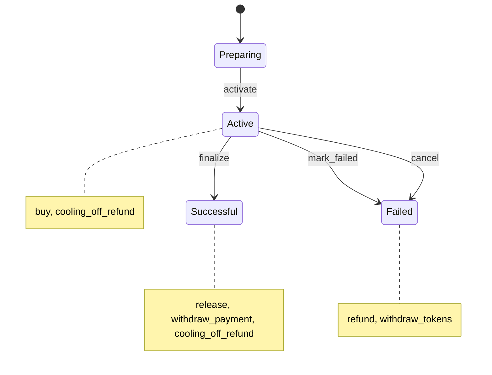

# offer-sale

- **What it does.** Runs the escrow and lifecycle of one offering. Investors reserve tokens by paying USDC. The issuer finalizes the offering, or it fails. Then tokens are released, or payments are refunded. Investors may withdraw during their cooling-off window.
- **Who uses it.** Investors call `buy` and `cooling_off_refund`. The issuer's treasury (the owner) closes the offering and withdraws. Anyone, in practice the backend, runs `release` and `refund` in batches. The platform multisig can pause and holds upgrades.
- **Scope.** One instance per offering. A port of Base's `OfferTokenSale`.

**Draft (interface v0.4).** The contract lands in L4, which updates this document. The cross-cutting rules are in [interface.md](interface.md).

## States

Every transition emits `state_changed`. No state goes back.

An offering stays Successful even if cooling-off refunds later bring it below the minimum, as in Base. The minimum is only checked at `finalize`.

## Roles

| Role | How it is held | Held by | Can |
|---|---|---|---|
| owner | A stored address, set at construction | Issuer's treasury | Finalize, mark failed, cancel, withdraw, pause and unpause |
| OpenZeppelin access-control admin | OpenZeppelin `AccessControl` | Platform multisig | Grant and revoke `pauser` and `upgrader` |
| `pauser` | OpenZeppelin role | Platform multisig | Pause only |
| `upgrader` | OpenZeppelin role | Platform multisig | Replace the code |

As in the token, the issuer's owner is not the access-control admin, so it can't take over the platform's roles.

## Constructor

| Argument | Meaning |
|---|---|
| `owner` | Issuer's treasury |
| `platform` | Platform multisig: access-control admin, `pauser` and `upgrader` |
| `token` | The offering's `offer-token`. The tokens for sale are read from its total supply, as in Base, never passed in. |
| `payment_asset` | The USDC contract |
| `allowlist` | The global `offer-allowlist` |
| `price` | Stroops per token. Must be positive. |
| `hard_cap` | Maximum raised, in stroops. At least one token's price. |
| `cooling_off_secs` | Cooling-off window. At least 1 day; 5 days in Base's offerings. |
| `min_success_percent` | Share of the supply that must sell to finalize. Between 10 and 100; 75 in Base's offerings. |

The minimums are the ones Base's factory enforces. The construction emits `configured` with every value, replacing the event Base's factory emitted.

## Reservation

One persistent entry per investor:

| Field | Meaning |
|---|---|
| `schema` | Struct version |
| `tokens` | Tokens reserved |
| `paid` | Stroops received |
| `last_purchase_at` | Ledger time of the last purchase. Every purchase restarts the window. |

## Totals

| Total | Meaning |
|---|---|
| `sold_tokens` | Tokens reserved or released, net of refunds |
| `raised` | Stroops received, net of refunds. Withdrawals don't reduce it. |
| `released_paid` | Stroops of reservations already released |
| `withdrawn` | Stroops already withdrawn |

The hard cap is checked against `raised`. Success means `sold_tokens × 100 ≥ supply × min_success_percent`, or everything sold.

## Calls

| Call | Authorized by | State | Effect |
|---|---|---|---|
| `activate()` | Open, decided with inventory in L2/L4 | Preparing | Checks the sale holds the whole supply and is a `controller` on the allowlist, then moves to Active. |
| `buy(investor, amount)` | `investor` | Active, not paused | Takes `amount` USDC from the investor and measures what actually arrived, as in Base. What arrived must be positive and an exact multiple of `price`. It reserves `received / price` tokens and consumes `received` of allowlist room. |
| `finalize()` | owner | Active | Requires success, and that the sale still holds every sold token (as in Base, since `xfer_admin` can move tokens). Moves to Successful. |
| `mark_failed()` | owner | Active | Requires the minimum not sold. Moves to Failed. |
| `cancel()` | owner | Active | Moves to Failed at any time. This is Base's `enableRefunds`. |
| `release(investors)` | anyone | Successful | For each investor, at most 30: transfers the reserved tokens, adds their `paid` to `released_paid`, and ends the reservation. Investors with nothing reserved are skipped. Fails if any investor's window is still open: `now ≤ last_purchase_at + cooling_off_secs`. |
| `refund(investors)` | anyone | Failed | For each investor, at most 20: returns the payment, ends the reservation and restores allowlist room. Investors with nothing reserved are skipped. |
| `cooling_off_refund(investor)` | `investor` | Active or Successful | Allowed until `last_purchase_at + cooling_off_secs` inclusive, and before release. Returns the payment, ends the reservation, restores allowlist room, and lowers `sold_tokens` and `raised`. |
| `withdraw_payment(payouts)` | owner | Successful | Pays every `(recipient, amount)` in one call, at most 30 payouts. **The total may not exceed `released_paid − withdrawn`.** |
| `withdraw_tokens(to, amount)` | owner | Failed | Returns tokens to the issuer. |
| `pause(caller)` | `caller`, owner or `pauser` | any | Blocks `buy`. |
| `unpause(caller)` | `caller`, owner | any | Resumes `buy`. |
| `upgrade(new_wasm_hash, operator)` | `operator`, holding `upgrader` | any | Replaces the code. |

Read functions:

- `state`;
- `config`: owner, token, payment asset, allowlist, price, supply, hard cap, cooling-off, minimum;
- `totals`;
- `reservation(investor)`, or the zero reservation;
- `cooling_off_ends_at(investor)`: 0 without a reservation;
- `withdrawable`;
- `preview_tokens(amount)`, which fails on an amount that isn't an exact multiple;
- `paused`, `has_role`, `schema_version`.

**Withdrawals.** The issuer can only withdraw money from released reservations: money that no investor can ask back anymore. Release is open to anyone, so the path is: release everyone past their window, then withdraw. This replaces Base's behaviour (NF-04), where the issuer could withdraw everything at once. Base's backend got away with it by releasing everyone in the same batch, which silently ended open cooling-off rights.

**Differences from Base:**

- **Release waits for the cooling-off window** (audit SCAN-01, recommended fix).
- **Withdrawals are limited to released money** (audit NF-04).
- **`withdraw_payment` takes every payout at once.** It replaces several `withdrawBrla` calls batched in one Safe transaction.
- **Pause is new.** Base's sale has none.
- **`RefundsEnabled` is split** into `marked_failed` and `cancelled`.
- **Removed:**
  - `inventoryProvider`, `updateInventoryProvider` and its event, replaced by the inventory mechanism ([interface 5.1](interface.md#51-deploying-an-offering));
  - the flags `isFinalized`, `refundsEnabled` and `inventorySeeded`, which `state` covers;
  - `version()`, replaced by `schema_version`.

Points still open for L4 are listed in [interface 11](interface.md#11-open-points): skip-and-report in batches, leftover tokens after success, and what pause blocks.

## Events

| Event | Topics | Data | When |
|---|---|---|---|
| `configured` | `configured` | `{allowlist, cooling_off_secs, hard_cap, min_success_percent, owner, payment_asset, price, supply, token}` | Construction |
| `state_changed` | `state_changed` | `{from, to}` | Every transition |
| `activated` | `activated` | `{tokens}` | `activate` |
| `purchased` | `purchased`, investor | `{last_purchase_at, paid, raised, reserved_paid, reserved_tokens, sold_tokens, tokens}` | `buy`. `paid` and `tokens` are this purchase; `reserved_*` are the investor's totals afterwards; `sold_tokens` and `raised` are the offering's totals afterwards. |
| `finalized` | `finalized` | `{raised, sold_tokens}` | `finalize` |
| `marked_failed` | `marked_failed` | `{raised, sold_tokens}` | `mark_failed` |
| `cancelled` | `cancelled` | `{raised, sold_tokens}` | `cancel` |
| `released` | `released`, investor | `{paid, tokens}` | `release`, per investor served |
| `refunded` | `refunded`, investor | `{paid, raised, reason, sold_tokens, tokens}` | `refund` (`reason` = `failed`) and `cooling_off_refund` (`reason` = `cooling_off`). `raised` and `sold_tokens` are the totals afterwards. |
| `payment_withdrawn` | `payment_withdrawn`, recipient | `{amount}` | `withdraw_payment`, per payout |
| `tokens_withdrawn` | `tokens_withdrawn`, to | `{amount}` | `withdraw_tokens` |
| `pause_changed` | `pause_changed`, caller | `{paused}` | `pause` and `unpause` |
| `upgraded` | `upgraded` | `{new_wasm_hash, schema_version}` | `upgrade` |

The totals in `purchased` and `refunded` let the backend recover the offering's state from any later event, even after missing some. The RPC keeps events for only about 7 days.

Also emitted:

- From OpenZeppelin: `paused`, `unpaused`, and the role events.
- From the token: a `transfer` for every release.
- From the USDC contract: a `transfer` for every purchase, refund and payout.

`reason` is a symbol. `from` and `to` in `state_changed` are symbols: `preparing`, `active`, `successful`, `failed`.

## Errors

| Code | Name | When |
|---|---|---|
| 6200 | `NotPreparing` | `activate` outside Preparing |
| 6201 | `NotActive` | `buy`, `finalize`, `mark_failed` or `cancel` outside Active |
| 6202 | `NotSuccessful` | `release` or `withdraw_payment` outside Successful |
| 6203 | `NotFailed` | `refund` or `withdraw_tokens` outside Failed |
| 6204 | `InventoryMissing` | `activate` without the whole supply held |
| 6205 | `NonPositiveAmount` | An amount or price that isn't positive |
| 6206 | `NotWholeTokens` | What arrived isn't an exact multiple of the price |
| 6207 | `ExceedsSupply` | `buy` beyond the tokens left |
| 6208 | `HardCapExceeded` | `buy` beyond the hard cap |
| 6209 | `NothingReceived` | No USDC arrived |
| 6210 | `SuccessCriteriaUnmet` | `finalize` below the minimum |
| 6211 | `SuccessCriteriaMet` | `mark_failed` at or above the minimum |
| 6212 | `CoolingOffClosed` | `cooling_off_refund` outside the window, after release, or in Failed |
| 6213 | `NothingReserved` | `cooling_off_refund` with no reservation |
| 6214 | `CoolingOffOpen` | `release` that includes an investor whose window is still open |
| 6215 | `BatchTooLarge` | More than 30 investors in `release`, 20 in `refund`, or 30 payouts |
| 6216 | `InvalidConfig` | Constructor arguments outside the limits |
| 6217 | `TokensMissing` | `finalize` while the sale holds fewer tokens than sold |
| 6218 | `ExceedsWithdrawable` | `withdraw_payment` beyond `released_paid − withdrawn` |
| 6219 | `NotController` | `activate` before the sale is a controller on the allowlist |

Codes from the contracts it calls, which surface unchanged:

- **allowlist:** 6100 `InvestorNotEnabled` and 6101 `AllocationExceeded` during `buy`, and 6103 `RestoreExceedsConsumed` during refunds (see the [known issue](offer-allowlist.md#known-issue-refunds-after-the-monthly-reset));
- **token:** 6000 and 100;
- **USDC:** a balance or trustline error during a payment, refund or payout;
- **OpenZeppelin:** 1000 `EnforcedPause` and 2000 `Unauthorized`.

## Storage

- One persistent reservation per investor, extended on every touch.
- State, configuration, totals, owner, pause flag and schema version: instance, extended on every call.
