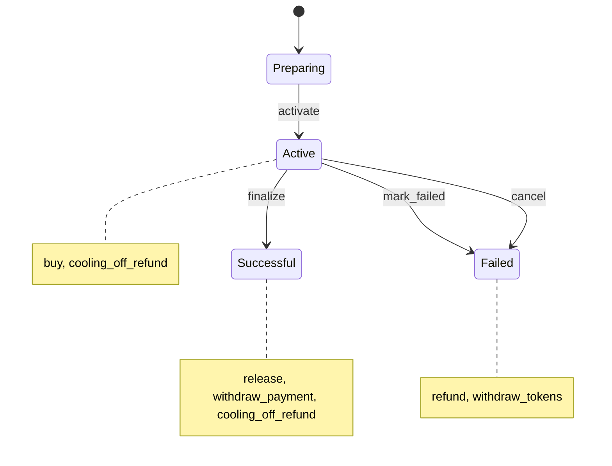

# offer-sale

- **What it does.** Runs the escrow and lifecycle of one offering. Investors reserve tokens by paying USDC. The tokenizer finalizes the offering, or it fails. Then tokens are released, or payments are refunded. Investors may withdraw during their cooling-off window.
- **Who uses it.** Investors call `buy` and `cooling_off_refund`. The tokenizer's treasury (the owner) closes the offering and withdraws. Anyone, in practice the backend, runs `release` and `refund` in batches. The platform multisig holds upgrades and can pause (recommended, pending the team).
- **Scope.** One instance per offering. A port of Base's `OfferTokenSale`.

**Draft (interface v0.5).** The contract lands in L4, which updates this document. The cross-cutting rules are in [interface.md](interface.md).

## States

Every transition emits `state_changed`. No state goes back.

An offering stays Successful even if cooling-off refunds later bring it below the minimum, as in Base. The minimum is only checked at `finalize`.

## Roles

| Role | How it is held | Held by | Can |
|---|---|---|---|
| owner | A stored address, set at construction, **with no setter** | Tokenizer's treasury | Finalize, mark failed, cancel, withdraw, pause and unpause |
| OpenZeppelin access-control admin | OpenZeppelin `AccessControl` | Platform multisig | Grant and revoke `pauser` and `upgrader` |
| `pauser` | OpenZeppelin role | Platform multisig | Pause only, never unpause. **Recommended (ADR 0003), pending the team** |
| `upgrader` | OpenZeppelin role | Platform multisig | Replace the code |

As in the token, the tokenizer's owner is not the access-control admin, so it can't take over the platform's roles. Rotating the treasury's officers keeps the same account address, so the owner needs no setter.

## Constructor

| Argument | Meaning |
|---|---|
| `owner` | Tokenizer's treasury |
| `platform` | Platform multisig: access-control admin, `pauser` and `upgrader` |
| `token` | The offering's `offer-token`. The tokens for sale are read from its total supply, as in Base, never passed in. |
| `payment_asset` | The USDC contract |
| `allowlist` | The global `offer-allowlist` |
| `price` | Stroops per token. Must be positive. |
| `hard_cap` | Maximum raised, in stroops. At least one token's price; full supply × price in Base's offerings, so there it never binds before the supply does. |
| `cooling_off_secs` | Cooling-off window. At least 1 day; 5 days in Base's offerings. |
| `min_success_percent` | Share of the supply that must sell to finalize. Between 10 and 100; 75 in Base's offerings. |

The minimums are the ones Base's factory enforces. The construction emits `configured` with every value, replacing and extending the event Base's factory emitted (hard cap, cooling-off and minimum are new in it).

## Reservation

One persistent entry per investor:

| Field | Meaning |
|---|---|
| `schema` | Struct version |
| `tokens` | Tokens reserved |
| `paid` | Stroops received |
| `last_purchase_at` | Ledger time of the last purchase. Every purchase restarts the window. |

## Totals

| Total | Meaning |
|---|---|
| `sold_tokens` | Tokens reserved or released, net of refunds |
| `raised` | Stroops received, net of refunds. Withdrawals don't reduce it. |
| `released_paid` | Stroops of reservations already released |
| `withdrawn` | Stroops already withdrawn |

The hard cap is checked against `raised`. Success means `sold_tokens × 100 ≥ supply × min_success_percent`, or everything sold.

## Calls

| Call | Authorized by | State | Effect |
|---|---|---|---|
| `activate()` | Open, decided with inventory in L2/L4 | Preparing | Checks the sale contract holds the whole supply (6204) and is a `controller` on the allowlist (6219), then moves to Active. So it must run after the `controller` grant. |
| `buy(investor, amount)` | `investor` | Active, not paused | Takes `amount` USDC from the investor and measures what actually arrived, as in Base. What arrived must be positive and an exact multiple of `price`. It reserves `received / price` tokens and consumes `received` of allowlist room. |
| `finalize()` | owner | Active | Requires success, and that the sale contract still holds every sold token (as in Base, since `xfer_admin` can move tokens). This check runs only once. Moves to Successful. |
| `mark_failed()` | owner | Active | Requires the minimum not sold. Moves to Failed. |
| `cancel()` | owner | Active | Moves to Failed at any time. This is Base's `enableRefunds`. |
| `release(investors)` | anyone | Successful | For each investor, at most 30: transfers the reserved tokens, adds their `paid` to `released_paid`, and ends the reservation. Investors with nothing reserved are skipped. Fails if any investor's window is still open: `now ≤ last_purchase_at + cooling_off_secs` (recommended, ADR 0002, pending the team). |
| `refund(investors)` | anyone | Failed | For each investor, at most 20: returns the payment, ends the reservation and restores allowlist room. Investors with nothing reserved are skipped. |
| `cooling_off_refund(investor)` | `investor` | Active or Successful | Allowed until `last_purchase_at + cooling_off_secs` inclusive, and before release. Returns the payment, ends the reservation, restores allowlist room, and lowers `sold_tokens` and `raised`. |
| `withdraw_payment(payouts)` | owner | Successful | Pays every `(recipient, amount)` in one call, at most 30 payouts. **The total may not exceed `released_paid − withdrawn`** (recommended, ADR 0004, pending the team). |
| `withdraw_tokens(to, amount)` | owner | Failed | Sends tokens to the address the owner names. |
| `pause(caller)` | `caller`, owner or `pauser` | any | Blocks `buy`. The scope is provisional (see below). The platform's `pauser` is recommended (ADR 0003), pending the team. |
| `unpause(caller)` | `caller`, owner | any | Resumes `buy`. |
| `upgrade(new_wasm_hash, operator)` | `operator`, holding `upgrader` | any | Replaces the code. |

Read functions:

- `state`;
- `config`: owner, token, payment asset, allowlist, price, supply, hard cap, cooling-off, minimum;
- `totals`;
- `reservation(investor)`, or the zero reservation;
- `cooling_off_ends_at(investor)`: 0 without a reservation;
- `withdrawable`;
- `preview_tokens(amount)`, which fails on an amount that isn't an exact multiple;
- `paused`, `has_role` (the role index, or void when not held), `schema_version`.

**Batch sizes.** 30 investors per `release` (about 364 B of events per investor, about 10.9 KB), 20 per `refund` (792 B per investor: USDC `transfer`, `refunded` and `allocation_restored`; about 15.8 KB at 20, about 3% under the 16 KB event limit, so adding a field to `refunded` or `allocation_restored` means lowering the batch), and 30 payouts per `withdraw_payment` (roughly 430 B per payout: USDC `transfer` plus `payment_withdrawn`; about 12.9 KB at 30). All three are estimates, reviewed in L4 ([interface 6.4](interface.md#64-batch-sizes)).

**Withdrawals. Recommended (ADR 0004), pending the team.** The tokenizer can only withdraw money from released reservations: money that no investor can ask back anymore. Release is open to anyone, so the path is: release everyone past their window, then withdraw. The consequence the team is asked to accept: the tokenizer and the issuer are paid up to `cooling_off_secs` (5 days in Base's offerings) after the last purchase. This replaces Base's behaviour (NF-04), where the tokenizer could withdraw everything at once; the audit response claims a backend check against open refund obligations, but no such check exists in Base's code. Base's backend got away with it by releasing everyone in the same batch, which silently ended open cooling-off rights.

Under this cap the backend computes the payout amounts from the on-chain `withdrawable`, not from its own collected total: a split over the full total fails with 6218 until every investor is released and nobody refunded since. The investors to release are those with a reservation on chain (`purchased` events), not only the backend's confirmed orders; an on-chain buyer missing from the backend's list is never released, and `withdrawable` never reaches the total.

**Differences from Base:**

- **Release waits for the cooling-off window** (recommended, ADR 0002, pending the team). Audit SCAN-01's recommended fix was `onlyOwner` on release; here release stays open to anyone and the window is enforced on chain instead, which removes the early-release path without making release depend on the treasury.
- **Withdrawals are limited to released money** (audit NF-04; recommended, ADR 0004, pending the team).
- **`withdraw_payment` takes every payout at once.** It replaces several `withdrawBrla` calls batched in one Safe transaction.
- **Pause is new.** Base's sale has none; there the platform could still stop purchases by revoking the sale's allowlist `controller` role or disabling allocations. The platform's `pauser` is recommended (ADR 0003), pending the team. What a paused sale contract blocks is provisional: today `buy` only. The recommendation to the team is (c): block everything that sends money to the tokenizer (`buy`, `release`, `withdraw_payment`), never the investor's exit (`refund`, `cooling_off_refund`).
- **`RefundsEnabled` is split** into `marked_failed` and `cancelled`.
- **Removed:**
  - `inventoryProvider`, `updateInventoryProvider` and its event, replaced by the inventory mechanism ([interface 5.1](interface.md#51-deploying-an-offering));
  - the flags `isFinalized`, `refundsEnabled` and `inventorySeeded`, which `state` covers;
  - `version()`, replaced by `schema_version`.

**Leftover tokens.** No `offer-sale` call returns them after success: `withdraw_tokens` requires Failed, as in Base. That covers tokens returned through cooling-off (audit SCAN-02) and tokens never sold. They are not locked, though: the token's `admin_transfer` (Base's `adminTransfer`) lets `xfer_admin` move unsold tokens out of the sale contract. The same power can pull sold-but-unreleased tokens out of a Successful sale contract, and `release` then fails, since `finalize` checks the balance only once. So the backend must never admin-transfer more than `balance − (sold_tokens − released tokens)` out of a Successful sale contract. Where leftovers go (back to the tokenizer, to the issuer, or nowhere, as there is no burn) is a product and legal question pending the team; `admin_transfer` is a fact about the contracts, not the decided exit path.

Points still open are listed in [interface 11](interface.md#11-open-points): skip-and-report in batches (L4), and, for the team, leftover tokens after success and what pause blocks.

## Events

| Event | Topics | Data | When |
|---|---|---|---|
| `configured` | `configured` | `{allowlist, cooling_off_secs, hard_cap, min_success_percent, owner, payment_asset, price, supply, token}` | Construction |
| `state_changed` | `state_changed` | `{from, to}` | Every transition |
| `activated` | `activated` | `{tokens}` | `activate` |
| `purchased` | `purchased`, investor | `{last_purchase_at, paid, raised, reserved_paid, reserved_tokens, sold_tokens, tokens}` | `buy`. `paid` and `tokens` are this purchase; `reserved_*` are the investor's totals afterwards; `sold_tokens` and `raised` are the offering's totals afterwards. |
| `finalized` | `finalized` | `{raised, sold_tokens}` | `finalize` |
| `marked_failed` | `marked_failed` | `{raised, sold_tokens}` | `mark_failed` |
| `cancelled` | `cancelled` | `{raised, sold_tokens}` | `cancel` |
| `released` | `released`, investor | `{paid, tokens}` | `release`, per investor served |
| `refunded` | `refunded`, investor | `{paid, raised, reason, sold_tokens, tokens}` | `refund` (`reason` = `failed`) and `cooling_off_refund` (`reason` = `cooling_off`). `raised` and `sold_tokens` are the totals afterwards. |
| `payment_withdrawn` | `payment_withdrawn`, recipient | `{amount}` | `withdraw_payment`, per payout |
| `tokens_withdrawn` | `tokens_withdrawn`, to | `{amount}` | `withdraw_tokens` |
| `pause_changed` | `pause_changed`, caller | `{paused}` | `pause` and `unpause` |
| `upgraded` | `upgraded` | `{new_wasm_hash, from_schema_version}` | `upgrade`. The old code emits it, so `from_schema_version` is the schema version before the upgrade. |

The totals in `purchased` and `refunded` let the backend recover the offering's state from any later event, even after missing some. The RPC keeps events for only about 7 days.

Also emitted:

- From OpenZeppelin: `paused`, `unpaused`, and the role events.
- From the token: a `transfer` for every release.
- From the USDC contract: a `transfer` for every purchase, refund and payout.

`reason` is a symbol. `from` and `to` in `state_changed` are symbols: `preparing`, `active`, `successful`, `failed`.

## Errors

| Code | Name | When |
|---|---|---|
| 6200 | `NotPreparing` | `activate` outside Preparing |
| 6201 | `NotActive` | `buy`, `finalize`, `mark_failed` or `cancel` outside Active |
| 6202 | `NotSuccessful` | `release` or `withdraw_payment` outside Successful |
| 6203 | `NotFailed` | `refund` or `withdraw_tokens` outside Failed |
| 6204 | `InventoryMissing` | `activate` without the whole supply held |
| 6205 | `NonPositiveAmount` | An amount or price that isn't positive |
| 6206 | `NotWholeTokens` | What arrived isn't an exact multiple of the price |
| 6207 | `ExceedsSupply` | `buy` beyond the tokens left |
| 6208 | `HardCapExceeded` | `buy` beyond the hard cap |
| 6209 | `NothingReceived` | No USDC arrived |
| 6210 | `SuccessCriteriaUnmet` | `finalize` below the minimum |
| 6211 | `SuccessCriteriaMet` | `mark_failed` at or above the minimum |
| 6212 | `CoolingOffClosed` | `cooling_off_refund` outside the window, after release, or in Failed |
| 6213 | `NothingReserved` | `cooling_off_refund` with no reservation |
| 6214 | `CoolingOffOpen` | `release` that includes an investor whose window is still open |
| 6215 | `BatchTooLarge` | More than 30 investors in `release`, 20 in `refund`, or 30 payouts |
| 6216 | `InvalidConfig` | Constructor arguments outside the limits |
| 6217 | `TokensMissing` | `finalize` while the sale contract holds fewer tokens than sold |
| 6218 | `ExceedsWithdrawable` | `withdraw_payment` beyond `released_paid − withdrawn` |
| 6219 | `NotController` | `activate` before the sale contract is a `controller` on the allowlist |

Codes from the contracts it calls, which surface unchanged:

- **allowlist:** 6100 `InvestorNotEnabled` and 6101 `AllocationExceeded` during `buy`, and 6103 `RestoreExceedsConsumed` during refunds (see the [known issue](offer-allowlist.md#known-issue-refunds-after-the-monthly-reset));
- **token:** 6000 and 100;
- **USDC** (a Stellar Asset Contract), as `Error(Contract, #n)`, during a payment, refund or payout. The backend leaves an investor failing with 11 or 13 out of the batch and retries the rest. These codes don't collide with OpenZeppelin's (100+) or BWB's (6000+):
  - 8 `NegativeAmountError`;
  - 10 `BalanceError`: insufficient balance;
  - 11 `BalanceDeauthorizedError`: USDC is `AUTH_REVOCABLE`, so Circle can freeze an investor's balance, and also the sale contract's own escrow. A frozen escrow fails refunds, cooling-off and payouts until it is reauthorized. Clawback is disabled today;
  - 13 `TrustlineMissingError`: the investor dropped the USDC trustline;
- **OpenZeppelin:** 1000 `EnforcedPause`, 1001 `ExpectedPause`, 2000 `Unauthorized` and 2007 `RoleNotHeld`.

## Storage

- One persistent reservation per investor, extended on every touch.
- State, configuration, totals, owner, pause flag and schema version: instance, extended on every call.
